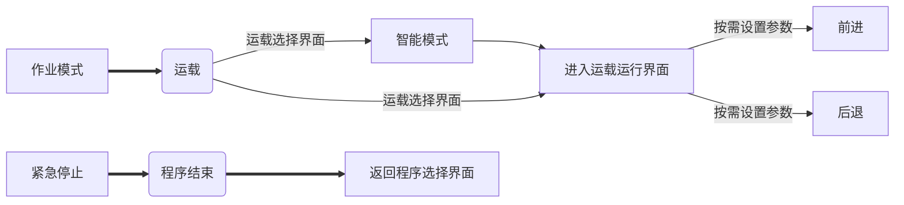
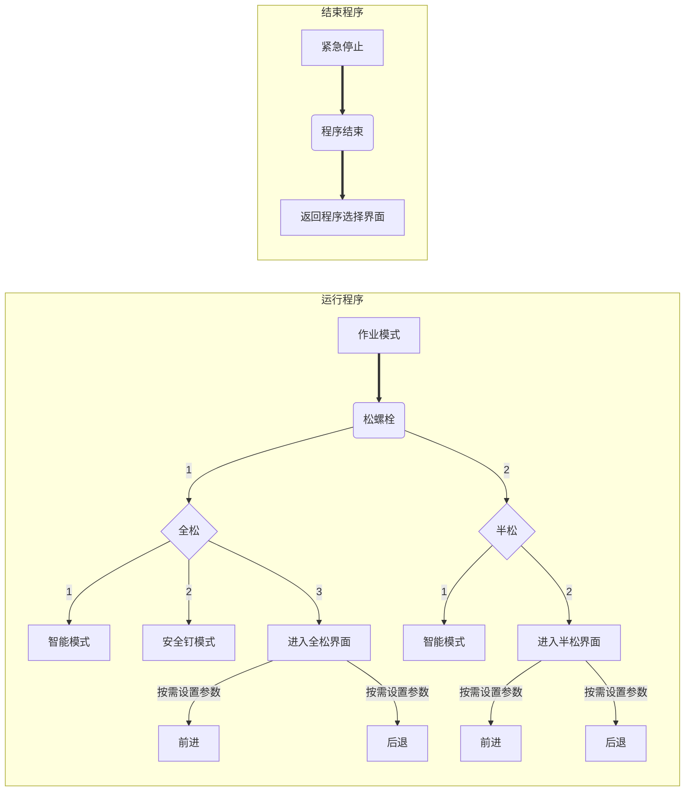
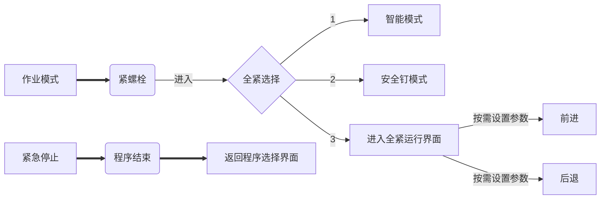

# 灵犀智能轨道作业机器人——产品说明说明文档

> 【声明⚠️】：本说明文档创建于2022年2月13日18:09，想法DEMO开始于2021年5月21日，<font color=red>数据更新日期：20240109—15：18</font> 开发者：中国铁路沈阳局集团有限公司-沈阳工务机械段-冯宏健。其中所有版本中以本Markdown文档为准，文档中所涉及图片仅供参考，请以实物为准！

---


##  临时笔记区：


所有硬件于2023年10月16日上午12:20分组装完成（于2023年7月25日开始研发设计制作，执行百日计划！）

笔记中所有图片现已全转存为本地相对路径，断开cdn请求，避免无网不加载！


<details> <summary>展开查看——月度计划</summary> 内容:<pre>  <code>   //&nbsp;8月档  <br>   事件记录{  <br>   <span class="deletion">-  1 [电缸：速度max=950mm/s（设置值软件限制，软件单位不规范，设置950mm/s=实际95mm/s）]</span>   <br>   <span class="deletion">-  2 [实际硬件允许 500mm/s，扳头套筒下降距离测试489mm （实际钢轨上时估算489+180=669）]</span>   <br>   <span class="addition">+  1 [两螺丝中心距离 ：60cm   ]</span>   <br>   <span class="addition">+  2 [轨道：60/60N  3m 5根枕木]</span> <br>   <span class="addition">+  3 [轨高150mm，轨距螺丝中心9cm-10cm更倾向9cm，取极限9.5cm （普通） ]</span> 
<br>   }    </code> </pre> 【完】        </details>


<details> <summary>展开查看——开发过程视频及图片记录</summary> 介绍:<pre><code>开发1</code><code>开发4</code><code>开发5</code><code>开发6</code> <video id="video" controls="" preload="none"> <source id="mp4" src="https://www.hongjian.cn/%E4%BA%A7%E5%93%81%E6%89%8B%E5%86%8C%20(copy).assets/videoPHOTO/bianying1.mp4" type="video/mp4"> </video> <code>  计算机1</code>  <video id="video" controls="" preload="none"> <source id="mp4" src="https://www.hongjian.cn/%E4%BA%A7%E5%93%81%E6%89%8B%E5%86%8C%20(copy).assets/videoPHOTO/bianying2.mp4" type="video/mp4"> </video> <code>  计算机2</code>       </pre> 【完】        </details>


---


- &#x27A4; 快速导航                                    方式：&#x27A4; 使用 <kbd>Ctrl</kbd>+<kbd>鼠标点击</kbd>跳转

  

  - [01  PLC输入输出点](#PLC输入点)
  - [02  基业箱快速接头连接图序](#基业箱快速接头连接图序)
  - [03  采购清单](#采购清单)
  - [04  M区](#自定义M点)
  - [05  定时与计数器](#定时与计数器)
  - [06  V区](#V区)
  - [07  VB区](#VB区)
  - [08  VW区](#VW区)
  - [09  VD区](#VD区)


# 目录

​                                                    **⬆️[回到顶端](#目录)**                                                  **⬇️[到最底端](#联系我们)**


[TOC]


---


<center>⬇️⬇️⬇️⬇️以下为正文⬇️⬇️⬇️⬇️</center>


## 产品简介:

> ​        应用于铁路工务系统的"灵犀智能"铁路作业平台，是一个融合计算机视觉、传感器融合、同时搭载AI智能检测算法、工业自动化、单片机、HMI人机交互界面、伺服系统及多种电气元器件等全新研发改造的小型作业机械智能装备扩展平台，从而实现智能化、自动化作业。
>
> 该设备可按照操作人员设定的参数自动松紧螺栓，并搭载了很多符合现场的实用功能，从而提高了一线作业的生产效率。目前主要应用于长轨放散施工及成段更换钢轨作业，未来计划应用于大型养路机械的智能化改造等。
>
> 产品特点：
>
> - 全自动运载及松紧螺栓功能（无人化作业）
> - 安全闸、安全钉模式、AI智能模式以及后续计划开发的队列模式。
> - 模块化快速拼装。
> - 宽温作业范围适应能力强
>
> 产品定位：效率+安全
>
> 产品宣传口号：
>
> - 1.换轨放散效率高，工务作业选灵犀。
> - 2.要想工务效率高，放散施工选灵犀。
>
> 续航：连续运转>=3小时 (天窗时间范围)，也可选购更大容量电池组以提升续航。
>
> **安全方面：**
>
> 软件在环    硬件在环    车辆在环     人员在环


该产品集车辆学、人工智能、计算机科学、自动控制等多学科应用于一体，是一个非常复杂的系统。同时该平台采用高扩展硬件结构平台的方式，搭载多传感器套件，参照多冗余安全机制设计并可提供持续的开发资源。而要搭建一个闭环的自动作业系统，不仅技术门槛高，还面临着资金成本高、政策文件约束等多方面的挑战。该手册旨在帮助用户通过理论加实践更高效地学习并使用本产品。


---


##  产品设计图  

**⬆️[回到顶端](#目录)**                    **⬇️[到最底端](#联系我们)**

### 三维俯视图

⚠️（部分结构已更改）

.assets/3dzslx0-4775289.jpeg)


### 实物图 


### 架构图 v1.5

.assets/jiagoutu15-4775289.png)


### 电气图V1.5

.assets/%E6%88%AA%E5%B1%8F2023-10-08%2009.41.35-4775290.png)


**⬆️[回到顶端](#目录)**                    **⬇️[到最底端](#联系我们)**

###  HMI界面

.assets/%E6%88%AA%E5%B1%8F2023-08-29%2010.58.32-4775294.png)


### IO点位图

.assets/%E6%88%AA%E5%B1%8F2023-08-29%2018.19.52-4775291.png)


**通信板卡：**

RS485(port 0)： `公-母（2-2 ｜ 3-3 ｜5-5）`、`公-公（2-3｜ 3-2 ｜5-5）`、`母-母（2-3｜ 3-2 ｜5-5）`

```
DB9公头： 1 2 3 4 5                DB9母头： 5 4 3 2 1        

          6 7 8 9                           9 8 7 6

2号引脚:   RXD 接受                           TXD 发送

3号引脚:   TXD 发送                           RXD 接受

5号引脚：  GND接地                            GND接地    
```

ab信号，a接a，b接b，而在200smart plc中，a接b，b接a

⚠️**注意：** <font color=red>plc扩展485口：（3+）——（A)，（8-）——（B) （按此连接）</font>

当PLC公共输入M点接负极时，PNP传感器的公共信号线接负极。


2---24v返回

**3---RS485 B信号**

5---5v返回（-负极）

6--- +5v

7--- +24v

**8---RS485 A信号**


> 通信板卡1(Port1端口，非Port0)——rs485方案：
>
> - TX(PLC通信1口板卡)——RS485-B(外部设备接线B)
> - RX(PLC通信1口板卡)——RS485-A(外部设备接线A)


**更改点位记录：**

- <kbd>I2.7预留 </kbd> ——> 计划ai结果处理1点位。
- <kbd>I2.6预留 </kbd> ——> 计划ai结果处理2点位。
- <kbd>I2.5预留 </kbd> ——> 计划ai结果处理3点位。


## 接线图

**⬆️[回到顶端](#目录)**                    **⬇️[到最底端](#联系我们)**

### 主控制器接线图

#### PLC输入点

ST30为18输入，ST40为24输入。（增加6个输入）

| **I0.0** | **I0.1**  | **I0.2**  |   **I0.3**    |         **I0.4**          |         **I0.5**          | **I0.6**   |         **I0.7**          |         **I1.0**          | **I1.1**       | **I1.2** | **I1.3** |
| :------: | :-------: | --------- | :-----------: | :-----------------------: | :-----------------------: | ---------- | :-----------------------: | :-----------------------: | -------------- | -------- | -------- |
| 高速脉冲 |  编码器   | c激光雷达 |   c激光雷达   | a上限位（正限位）远电机侧 | a下限位（负限位）近电机侧 | a原点      | b上限位（正限位）远电机侧 | b下限位（负限位）近电机侧 | b原点          | a接近    | b接近    |
|          |           |           |               |                           |                           |            |                           |                           |                |          |          |
| **I1.4** | **I1.5**  | **I1.6**  |   **I1.7**    |         **I2.0**          |         **I2.1**          | **I2.2**   |         **I2.3**          |         **I2.4**          | **I2.5**       | **I2.6** | **I2.7** |
| a设定位1 | a转速检测 | b转速检测 | o紧急停止按钮 |         b设定位1          |        左行程开关         | 右行程开关 |        左激光传感         |        右激光传感         | 发动机点火信号 | 按钮绿色 | 按钮红色 |
|          |           |           |               |                           |                           |            |                           |                           |                |          |          |


#### PLC输出点

==ST30为12输出   ｜  ST40为16输出== （<u>*增加4个输出*</u>）

|    **Q0.0**     |    **Q0.1**     |     **Q0.2**      | **Q0.3**  |      **Q0.4**      |      **Q0.5**       | **Q0.6**           | **Q0.7**            | **Q1.0**  | **Q1.1**      |         **Q1.2**          |     **Q1.3**      |
| :-------------: | :-------------: | :---------------: | --------- | :----------------: | :-----------------: | ------------------ | ------------------- | --------- | ------------- | :-----------------------: | :---------------: |
|    a伺服脉冲    |    b伺服脉冲    |     a伺服方向     | c伺服脉冲 | 红色灯光、o松档继  |  绿色灯光、o紧档继  | 黄色灯光、o空档继  | b伺服方向           | c伺服方向 | c伺服抱闸刹车 | o接近、光电传感电源继电器 | USB切换器（SEL1） |
|                 |                 |                   |           |                    |                     |                    |                     |           |               |                           |                   |
|    **Q1.4**     |    **Q1.5**     |     **Q1.6**      | **Q1.7**  |                    |                     |                    |                     |           |               |                           |                   |
|  a伺服抱闸刹车  |  b伺服抱闸刹车  | USB切换器（SEL2） | 照明灯光  |                    |                     |                    |                     |           |               |                           |                   |
| 留空-开机即接通 | 留空-开机即接通 |                   |           | $\color{red}{B35}$ | $\color{blue}{B36}$ | $\color{red}{B37}$ | $\color{blue}{B38}$ |           |               |                           |                   |

#### PLC与PC通信参数

**⬆️[回到顶端](#目录)**                    **⬇️[到最底端](#联系我们)**

- PC----IP地址:192.168.2.37    子网：255.255.255.0     DNS:8.8.8.8

- PLC--IP地址:192.168.2.10   子网：255.255.255.0  

- SMART-v4 HMI                    IP地址:192.168.2.12    子网：255.255.255.0

  

### 基业箱快速接头连接图序

---

#### 1号板子接线

##### ·底部接线端子顺序

1—arduino-6引脚-紧档

2—arduino-5引脚-松档

3—arduino-4引脚-空档

4—arduino-pwm信号

5—plc-24v正极

6—plc-0v负极

7—arduino-5v-VCC-正极

8—arduino-0v-GND-负极

9—arduino-供电电源负极

10—arduino-供电电源正极（5v）

---

#### 2号板子接线

##### 继电器单元顺序

空档 ｜抱闸 ｜灯光｜传感｜视觉1 ｜视觉2｜松档 ｜紧档

》其中，抱闸和灯光是正极继电器控制（即抱闸和灯光公共负极，其对应正极分别与继电器连接，用于继电器控制正极导通）

》换挡指示灯是负极继电器控制（指示灯公共正极，其对应负极分别与松、紧、空继电器下2引脚连接，用于继电器控制负极导通）


##### ·右侧接线端子顺序

1—485语音负极

2—485语音正极

3—喇叭负极

4—喇叭正极

5—紧档继电器控制24v正极

6—松档继电器控制24v正极

7—空档继电器控制24v正极

8—空、松、紧档继电器控制公共0v负极

9—rs485语音负极-b

10—rs485语音负极-a


---

#### 3号板子接线

变压器组

48v      （主供电/动力电源）

48v-24v（处理器及传感电源）

48v-20v（ai边缘计算设备）

24v-5v（arduino、usb切换器等微处理模块）

---


#### CN1 传感控制线

-  【48针——重载连接器】

**⬆️[回到顶端](#目录)**                    **⬇️[到最底端](#联系我们)**

|      PLC 输入+      |      PLC输入 -      |      PLC 输出+      |     PLC输出  -      |
| :-----------------: | :-----------------: | :-----------------: | :-----------------: |
| $\color{#F00}{b35}$ | $\color{#05F}{b36}$ | $\color{#F00}{b37}$ | $\color{#05F}{b38}$ |


###### 48芯重载连接器

**详细接线图:**

|-------------------------------------------------|母头上层

o   o   o   o   o   o   o   o   o   o   o   o                         1      2       3       4       5      6       7      8      9      10     11      12                              

o   o   o   o   o   o   o   o   o   o   o   o                        13     14     15     16     17     18     19     20    21     22     23      24                         

<------------------------------------------------>母头中间层

o   o   o   o   o   o   o   o   o   o   o   o                        25     26     27     28     29     30     31     32    $\color{#05F}{33}$     $\color{#05F}{34}$     $\color{#05F}{35}$      $\color{#05F}{36}$    

o   o   o   o   o   o   o   o   o   o   o   o                        37     38     39     40     41     42     43     $\color{#05F}{44}$    $\color{#05F}{45}$     46     47      48   

|-------------------------------------------------|母头下层


46——舵机PWM-5V正极

47——舵机PWM-0V正极

48——舵机PWM-控制信号


1——**I1.5**左转速负极 （输入给plc-pnp信号）

2——**I1.6**右转速负极 （输入给plc-pnp信号）

3——左4继电器对应点（   12   ）-**I1.2**左接近信号 （输入给plc-pnp信号）

4——左4继电器对应点（   9   ）-**I1.3**右接近信号 （输入给plc-pnp信号）

5——左4继电器对应点（   11   ）-**I2.3**左激光信号 （输入给plc-pnp信号）

6——左4继电器对应点（   10   ）-**I2.4**右激光信号 （输入给plc-pnp信号）

7——**I2.1**左行程负极 （输入给plc-pnp信号）

8——**I2.2**右行程负极 （输入给plc-pnp信号）

9——左3继电器对应点（  7 ）—视觉照明24V、1号前照明灯光24V、2号前照明灯光24V （继电器控制正极——公共负极）     

10——公共0V    {视觉照明0v 、1号前照明灯光、2号后照明灯光、触摸屏供电负极}

11——PLC  24V 输入         { 按钮1公共正极、按钮2公共正极、按钮3公共正极、按钮4公共正极、前雷达避障正极、后雷达避障正极  

12——PLC  0V   输入         {   前雷达避障负极、后雷达避障负极 }

13——右2继电器对应点（   2  ）--**Q0.4**三色灯-红灯松-0V （继电器控制负极——公共正极）

14——右1继电器对应点（   2  ）--**Q0.5**三色灯-绿灯紧-0V （继电器控制负极——公共正极）

15——左1继电器对应点（   2  ）--**Q0.6**三色灯-黄灯空-0V （继电器控制负极——公共正极）

16——公共24V    {三色灯-红灯 、三色灯-绿灯、三色灯-黄灯、触摸屏供电正极}

17——**I0.2**前向雷达信号1（输入给plc-pnp信号）

18——**I0.6**磁性1-0v（左原点）             --------------（输入给plc-pnp信号）

19——**I0.4**磁性2-0v（左上（正）限位）--------------（输入给plc-pnp信号）

20——**I0.5**磁性3-0v（左下（负）限位）--------------（输入给plc-pnp信号）

21——**I1.1**磁性4-0v（右原点）             --------------（输入给plc-pnp信号）

22——**I0.7**磁性5-0v（右上（正）限位）--------------（输入给plc-pnp信号）

23——**I1.0**磁性6-0v（右下（负）限位）--------------（输入给plc-pnp信号）

24——**I1.7**按钮盒-按钮1（紧急停止按钮）-负极输入（负极pnp接入、公共正极）

25并接11——PLC  24V 输入         {左转速正极、右转速正极、左接近正极、右接近正极、左激光正极、右激光正极、左行程正极、右行程正极、磁性1（左原点）、磁性2（左上限位）、磁性3（左下限位）、磁性4（右原点）、磁性5（右上限位）、磁性6（右下限位）}

**⬆️[回到顶端](#目录)**                    **⬇️[到最底端](#联系我们)**

26并接12——PLC  0V   输入         {左接近负极、右接近负极、左激光负极、右激光负极}

27并接16——1号公共24V  { 舵机24v正极、伺服1右抱闸、伺服2左抱闸}

28并接30——1号公共0V    { 舵机0v负极}

暂不接，【伺服1右抱闸正极转接入公共正极】-29——左2继电器对应点（  5   ）伺服1抱闸-右缸--24V正极  { 继电器控制正极、公共负极}

30并接10——2号公共0V  { 伺服1抱闸负极、伺服2抱闸负极、伺服3抱闸负极、伺服4抱闸负极}

@暂不接-31——左2继电器对应点（  8  ）伺服4抱闸（备用）-24V正极       { 继电器控制正极、公共负极}     「待使用！」  

32—发电机组发电24V正极——整流桥——点火固态DD继电器正极控制点（  3  ）——继电器输出负极控制点（  1  ）——plc I2.5点位


33-36留空                                         （防止干扰pwm信号）

@暂不接，【伺服2左抱闸正极转接入公共正极】-37——左2继电器对应点（  6   ）伺服2抱闸-左缸---24V正极         { 继电器控制正极、公共负极}

38——i2.6按钮盒-按钮2绿-负极输入（负极pnp接入、公共正极）

39——i2.7按钮盒-按钮3红-负极输入（负极pnp接入、公共正极）

@暂不接-40——按钮盒-按钮4-负极输入（负极pnp接入、公共正极）

41——左2继电器对应点（  7   ）**伺服**3抱闸-主轮---24V正极       { 继电器控制正极、公共负极}

42—**I0.3** 后雷达信号（输入给plc-pnp信号）

43——发电机组发电0V负极——整流桥——点火固态DD继电器负极控制点（  4  ）——继电器输出控制点（  2  ）——plc 公共正极

44-45留空                                         （防止干扰pwm信号）


46——舵机PWM-5V正极

47——舵机PWM-0V正极

48——舵机PWM-控制信号

【i2.5点火信号！预留】

⚠️：建议并联接线在远端（即远离接头一侧）接线，防止占用重载连接器内部过多的空间


```
该区临时笔记：         2023.9.4记录

cn1规划：

转速2线          x2         24v正极、0v负极-pnp信号

接近3线          x2          24v正极、0v负极、pnp信号线
激光/光电3线      x2         24v正极、0v负极、pnp信号线
行程开关2线        x2         24v正极、0v负极-pnp信号 

视觉光源2线        x1         24v正极、0v负极
照明灯光2线       x2         24v正极、0v负极
三色指示灯5线     x1          24v正极、红灯负极1、黄灯负极2、绿灯负极3、蜂鸣器负极4 

雷达3线（或5线）   x1         24v正极、0v负极、pnp信号线
磁性2线          x6         24v正极、0v负极-pnp信号

触摸屏2线        x1          24v正极、0v负极 

舵机5线           x1         24v正极、0v负极、5v信号、0v信号、pwm信号
抱闸2线         x3（或x4）    24v正极、0v负极   
按钮2线           x4         24v正极、0v负极-pnp信号         


```

**⬆️[回到顶端](#目录)**                    **⬇️[到最底端](#联系我们)**

---


#### CN2 总电源线

- 2线  【48V b电源+ ｜ 48V b电源-】


#### CN3 编码器线

- 伺服1:   
- 伺服2:   【引脚套管-号码对应接线端子号】
- 伺服3:
- 伺服4（待定）:

#### CN4 伺服动力线

###### 17芯航空接口图

伺服驱动器端： 

- 伺服驱动器引脚： PE、U、V、W
  - 左右电缸：                         （从上到下）
    - PE(黄绿色线) ——9、13
    - W(黑色线)  ——10、14
    - V(红色线) ——7、12
    - U(白色线)——6、11
    - RB-
    - DC-
    - DC+/RB+
  - 主轮侧：
    - PE(黑线) ——5
    - W(黄绿色线)  ——4
    - V(红色线) ——3
    - U(黄色线)——2
    - RB-
    - DC-
    - DC+/RB+

**⬆️[回到顶端](#目录)**                    **⬇️[到最底端](#联系我们)**

###### 阵列图：

​                  o                                                           1

​        o     o     o     o                                  2      3       4      5

​     o     o     o     o     o                          6     7       8       9      10

​        o     o     o     o                                 11    12    13     14

​            o     o     o                                         15    16     17

​      ⚠️注意：     【引脚套管号码对应接线端子号】           8号留空（预留、抗干扰、便于接线空隙）


小号：2、3、4、5（主轮）—————航空接口上行

中号：6、7、9、10 （左缸）————航空接口中行

大号：11、12、13、14（右缸）——--航空接口下行（驱动器侧线已配蓝管进行标识-右侧电缸线）

- 伺服1:   
  - 2——U | 3——V | 4——W | 5——PE
- 伺服2:   【引脚套管-号码对应接线端子号】
  - 6——U | 7——V | 9——W | 10——PE
- 伺服3:
  - 11——U | 12——V | 13——W | 14——PE
- 伺服4（待定）:
  - 1——U | 15——V | 16——W | 17——PE


#### CN5 网线

- 触摸屏——网线防水连接器——控制箱（plc）


#### CN6 USB相机线

- 摄像头1（上方-前向） Pin1 |  Pin2 |  Pin3 |  Pin4
- 摄像头2（上方-后向） Pin1 |  Pin2 |  Pin3 |  Pin4
- 摄像头3（下方-底下） Pin1 |  Pin2 |  Pin3 |  Pin4

参数设定：

- 设置相机参数
  - 软件：AMCAP、PotPlayer
  - 步骤：均设为：1280x720 90fps mjpg格式       

**⬆️[回到顶端](#目录)**                    **⬇️[到最底端](#联系我们)**

**对比：**

|     传感器对比     |  检测物体   | 检测距离 |    干扰源    |    缺点    | 户外使用 |                     总结                     |
| :----------------: | :---------: | :------: | :----------: | :--------: | :------: | :------------------------------------------: |
|      接近开关      | 金属/非金属 |    短    |              |            |   yes    |              不适用于远距离检测              |
|     激光传感器     | 金属/非金属 |    长    | 黑色深色背景 | 无背景抑制 |   yes    | 不适用于检测物体和背景颜色相近深色物体的检测 |
|    超声波传感器    | 金属/非金属 |    长    |  速度、风速  |   误差大   |   yes    |           不适用于高速检测且误差大           |
| 背景抑制光电传感器 | 金属/非金属 |    长    |   户外强光   |  误差较小  |    no    |              不太适用于户外检测              |
|      行程开关      | 金属/非金属 |    短    |   机械零件   |  误差较小  |   yes    |           安装复杂成本高且占用资源           |


伺服驱动器侧：                                    伺服侧：

编码器（公头）                                   编码器（母头）  

动力线（4母头）                                 动力线（4公头）


### Arduino 输出控制点

|        **PLC端 **        | **Arduino端** |
| :----------------------: | :-----------: |
|   红空——Q.6——左3继电器   |    4Pin空     |
| **绿松**——Q.4——左1继电器 |  **5Pin松**   |
|   蓝紧——Q.5——左2继电器   |    6Pin紧     |

注意⚠️：arduino程序中定义4空（54度）、5松（47度）、6紧（66度），但实际运行时接线不得按此方式接线，要按上表中接线顺序接线。

  3点位：PWM   115200，脉冲输出，（SF15018MG24S: 红+ 、 黑- 、 白pwm信号）

 <font color=red> 4 空点位</font>——低角度——左1继电器---输入端（红8+  蓝7-）& 控制端（1红上｜<font color=red>5红线下</font>）

 <font color=green> 5 松点位</font>——高角度——左2继电器---输入端（红8+  蓝7-）& 控制端（1黑上｜<font color=green>5绿线下</font>）

 <font color=blue>  6 紧点位</font>——中角度——左3继电器---输入端（红8+  蓝7-）& 控制端（1黑上｜<font color=blue>5蓝线下</font>）

定义初始角度为54度、pwm信号为3号引脚，程序引脚1-2-3分别对引实际硬件pin4-5-6引脚。引脚按下转到对应角度，断开则恢复初始角度54度

### 传感器综合

**⬆️[回到顶端](#目录)**                    **⬇️[到最底端](#联系我们)**

#### 1 激光雷达接线

---

**A线——母头输出 out**

白 1  npn常开                                  粉2  npn常闭

<font color=blue> 黄3   pnp常开</font>(只连接此线)             紫4  pnp常闭              5深紫—GND

**B线——公头输入 in**

-  请看说明书

**C线——电源输出 out**

红 24V+                       黑0V-

**D线——网络调试RJ45口 **

电脑网络设置（pc）：填入外置网卡ip v4 参数中

- IP:192.168.158.61             子网掩码:255.255.255.0           网关:192.168.158.1

- 端口：6543（以实际为准！）                                              串口：COM1（以实际为准！）

雷达地址：在雷达软件打开后，将以下参数填入

- IP:192.168.158.98              子网掩码:255.255.255.0           网关:192.168.158.1

> 雷达图为毫米制，实测障碍物中心点距离雷达中心50cm，图标显示为500 （mm）
>
> 1cm=10mm，雷达图1000mm=实际1m

**⬆️[回到顶端](#目录)**                    **⬇️[到最底端](#联系我们)**

📒笔记：

防区设置：

- 前向雷达-矩形框


- 后向雷达-矩形框


- io属性：PNP模式默认1、4不勾选，输出高电平；（PNP）

- 输出映射：3号下面对应的报警区打勾；

------

#### 2 转速传感接线

南京-凯基特（品牌名）

- KJT-KG30TR-KG  380元/个                                二线制——常开
- 棕🏾24V+    蓝0V- （若PLC为PNP接法，即PLC公共M接负极,则传感器蓝线接PLC输入点）
- 硬件卡箍 55mm—70MM（建议），也可60mm—80MM。

#### 3 接近传感接线

乐清市-华全电气 （品牌名）

- LJA30M-60N1           L<=6cm                            三线制——PNP常开
- 顺时针——远距离（长距离有信号）               逆时针——近距离（长距离长无信号）
- 棕🏾24V+    蓝0V-    黑信号
- 电感接近传感器，只检测金属（铁、铝合金、不锈钢等金属制品），非金属无信号


#### 4 磁性开关

ALIF-元利富          （品牌名）             2线制

- ALIF-AG-39DF             用于伺服电缸上下限位及原点


**⬆️[回到顶端](#目录)**                    **⬇️[到最底端](#联系我们)**

#### 5 继电器综合接线

1.品牌：【欧姆龙OMRON ——LY2N-J】——24V           8点位         有极性输入

​           ｜ 2 ｜1 ｜

​    |  4 ｜     | 3 ｜               3-5、4-6常开点，当7-8通电，线圈得电吸合，3-5、4-6接通，1-5、2-6断开

​    |  6 ｜    ｜ 5｜                1-5、2-6常闭点，当7-8断电，线圈断电分离，1-5、2-6接通，3-5、4-6断开

​    | 8  ｜ 7 ｜                       7-负极 、 8+正极 

> 与舵机及灯光控制线接法：
>
> ｜ 7—0- ｜ 8—24+｜1—arduinoPIN4｜5—arduinoGND|｜2—LED24V入｜6—LED24V出 |

---

2.继电器品牌：【沈欣电器SENXI —HH54PL-MY4NJ—JWC68BL-4Z】——24V           14点位   无极性输入

​       基座型号：【PYF14A——2-M4X10】                                  元件标导轨安装尺寸：22mmx59mm

​          ｜ 3 ｜ 2 ｜ 1 ｜

  ｜8  ｜ 7 ｜ 6 ｜ 5 ｜               

  ｜12｜11｜10｜ 9 ｜                

  ｜ 4 ｜14｜13｜                       13-24V+ 、 14-0V-负极 ，也可 13-0V-负极 、 14-24V+正极 （无极输入）


- 当13-14通电，线圈得电吸合，5-9、6-10、7-11、8-12接通，1-9、2-10、3-11、4-12断开。

注：  5-9、6-10、7-11、8-12常开点（通电闭合）。

- 当13-14断电，线圈断电分离，1-9、2-10、3-11、4-12接通，5-9、6-10、7-11、8-12断开

> 与接近开关、激光传感器接法：
>
> ｜ 13—0- ｜ 14—24+｜
>
> ｜5—左接近黑信号输入｜  9—左接近黑信号输出｜6—右接近黑信号输入｜10—右接近黑信号输出 |
>
> ｜7—左激光黑信号输入｜11—左激光黑信号输出｜8—右激光黑信号输入｜12—右激光黑信号输出 |


提示：在只测试【直流三线pnp常开】传感器与中间继电器及开关电源连接线时；

​            传感器正线+连接开关电源正极+，传感器蓝负线-连接开关电源负极-；

​            继电器正极+连接传感器黑信号线，继电器负极-连接开关电源负极-。

**⬆️[回到顶端](#目录)**                    **⬇️[到最底端](#联系我们)**

3. 固态继电器

   - 品牌：
     - 淘宝：“贝尓美智能科技”
       - 单相固态继电器—FQFER_SSR-40DD(40A)---直流控直流----控制电压直流3V-32V DC    价格：15元/个
         - 输入3、4【直流3-32v】   输出2、1【直流5-200v】
         - 安装方式：自攻螺丝固定
   - 接线：
     - 发电机组发电24V正极（黄线）—48重载连接器的（32点位）；
     - 48重载连接器的（32点位）—点火继电器正极控制点（  3  ）—继电器输出控制点（  1  ）—plc I2.5点位；
     - 发电机组发电0V负极（蓝线）—48重载连接器的（43点位）；
     - 48重载连接器的（43点位）—点火继电器负极控制点（  4  ）—继电器输出控制点（  2  ）—plc 公共正极。

3. 单相桥式整流器/桥及散热器

   

   

   - 品牌：

     - 淘宝：“上海上整整流器”      官网：www.sh-sz.net

       - 上整KBPC3510整流桥充电器12v24v—— KBPC5010     28mmx28mmx23mm                4.2元/个

         转换系数：0.9（实际输出=原始输入x0.9）

         电流50a，电压1000v                            kbpc50a-10

         阻性负载输出直流电流：8a

       - 散热器正方形                        35mmx35mmx7mm                                                      2元/个

---


#### 6 小功率设备接线

**USB端口切换器：** 下方图即是该模块正面顶视图 以该方向为准。

|                引脚\电平\USB端口                |      CH4（默认）底部摄像头       |           CH3后摄像头            |           CH2 前摄像头           |          CH1(默认接通)           |
| :---------------------------------------------: | :------------------------------: | :------------------------------: | :------------------------------: | :------------------------------: |
|                    SEL1-Q1.3                    |             1高电平              |             1高电平              |             0低电平              |             0低电平              |
|                    SEL2-Q1.6                    |             1高电平              |             0低电平              |             1高电平              |             0低电平              |
|     GND【SEL1、SEL2共同接入（中间继电器）】     | SEL1、SEL2共同接入（中间继电器） | SEL1、SEL2共同接入（中间继电器） | SEL1、SEL2共同接入（中间继电器） | SEL1、SEL2共同接入（中间继电器） |
| 5V  【不接，板子供电为usb供电即视频总输出端口】 |               不接               |               不接               |               不接               |               不接               |


​                              <font color=red >  （此图中各对应元器件名称的，按从上倒下，从左到右与上方表格标识一致）</font>

“CH1—4”指：【1—4】号输入端口<——实物连接——>【1—4号摄像头】

“GND、5V”指：外置供电电源。

“SEL1、SEL2”指：

- 2个io口控制信号。
- 0为低电平，1为高电平。通过不同组合，从而控制同一时间四通道中的一个接通到公共端。

**⬆️[回到顶端](#目录)**                    **⬇️[到最底端](#联系我们)**

接线方式：

- 该模块GND—继电器5、继电6——连接sel1、sel2
- 该模块5V—悬空
- 该模块GND—24v中间继电器5A—sel1 ；        
- 该模块GND—24v中间继电器6B—sel2 ，


- 默认状况下：
  - 继电器A、B不接通，接通则sel1、sel2值为00，则1号端口接通。
  - 若继电器A不通、B通，则sel1、sel2值为01，则2号端口接通，按此规则以此类推。


**激光/光电传感器接线**   （PNP）

- 棕——正极 
- 蓝——负极
- 黑/白——信号线                 黑为普通按钮调节光电；白为激光测距仪即TOF光电


**M5stack 的RS485转换模块：**

- 正面引脚排布

  - 如图： GND   12V/24V    A    B

    


**⬆️[回到顶端](#目录)**                    **⬇️[到最底端](#联系我们)**

---


### 执行机构综合

#### 硬件外部


##### 0伺服电机接线

 <font color=red>  **1-q0.0 ｜ 3-q0.2 ｜ 2、4接plc负极 ｜8(数字输入)-24v+｜7(数字输入公共com端)--0v-**  </font> 

.assets/IMG_1199-4775291.jpg)


.assets/IMG_1200-4775291.jpg)


15针

**⬆️[回到顶端](#目录)**                    **⬇️[到最底端](#联系我们)**

.assets/%E6%88%AA%E5%B1%8F2023-08-25%2022.17.15-4775291.png)

#### 采购清单

[详情点击采购清单进行采购]( ./FAQS/硬件使用手册/采购清单-联系信息.md)    （待编写）

##### 1电缸

**左、右轴0和1  **        

- 品牌：东莞市德艺机械科技有限公司                                       3200RMB/个 
  - 50直连电缸                  DEA50-L02-C150-B010-K0400030-S0      额定转速：3000  丝杆导程：10  
    - 额定转速：3000   丝杆导程：10      减速比：1:1   
  - KIinco步科400瓦电机带抱闸        SMC60S-0040-30MBK-5DSU  FD124S-LB-000   
    -  Motor code:94    IP65
- 参数： L伸长max=150mm ｜ 加防冻润滑油 ｜无减速机    【驱动器：增量编码器】
- 电机：48V             抱闸：24V

##### 2舵轮

**主轴/轮2 **

- 品牌：广州智轮科技有限公司         
  - 200 驱动轮                  ZL-H200-S040-0048-60            7500RMB/个
  - KIinco步科--SMC60S-0040-30MAK-5DSU  FD124S-LB-000    Motor code:94    IP65    3000rpm
- 参数：28比的减速箱，额定转速3000转时刚好是1米/秒 ｜ 
- 驱动轮系列，轮径 180mm，轮宽 60mm，耐磨聚氨酯轮面（带纹路）。
- 内置二级行星减速箱， 速比 1：28，最快速度 1 米/秒。
- 牵引电机配步科低压伺服 400W48V3000 转，含脉冲控制驱动器。
- 行走电磁制 动器 24V8N.m
- 额定承载 1 吨。
- 电机：48V             抱闸：24V


**⬆️[回到顶端](#目录)**                    **⬇️[到最底端](#联系我们)**

##### 3舵机

- 品牌：珠海*华迈航空*科技有限公司                       60W
- SF15018MGS24               24V          PWM模式        角度360度     4500RMB/个
- 位置校准方法：软件调至松档位，舵机转到47度，调整舵盘孔位，确保连接杆竖直连接舵盘最外侧孔位，连接位置加垫片/圈。确保在竖直与地面垂直。（建议参考垫片数：上面7个共计7mm，下面无垫片）

##### 4 语音播报器


- 品牌：科星互联
- 485语音输出模块          ETV001-485               24V                             151RMB/个
- 8欧5W喇叭

##### 5 变压/稳压器

- 品牌：稳高电子    48v—24v    40A-M            输入48V输出24V  （宽压输入：35v-60v）      180RMB/个     
- 品牌：易稳电源    48v—20v    10A        Y2    输入48V输出20V   （宽压输入：30v-60v）     75RMB/个 
- 品牌：RCNUN      24v—5v        5A     胶壳     输入24V输出5V   （宽压输入：   8v-36v）       16RMB/个 （加另快递费10元）

##### 6 接近开关

- 品牌：华全电气- 24v直流三线pnp常开- LJA30M-60N1-检测范围60MM      185RMB/个   

##### 7 摄像头

- 近距离广角：

  - 品牌：淘宝“模组工厂直销生产”

  - 全局720p+180帧彩色[640x480跑180帧]    418RMB/个 

  - 角度 100度（无畸变），建议选购110度      

  - 接口：usb-zh 1.5 4p 母头

  - 摄像头选120 无畸变 

    注意⚠️：（原镜头视角范围：100度 ，焦距：2.5或2.8mm 超广角）

    安装：镜头接口都是14头的螺纹；座子是 18mm 镜头是14mm

  

- **远距离变焦工业镜头：**

  .assets/%E6%88%AA%E5%B1%8F2023-09-27%2012.41.51-4775291.png)

  

  品牌：“ 全瑞视讯 视频专家  ”

  全局快门高速高清摄像头模组 1080p高清工业拍照usb免驱安卓linux

  参数：5-50mm 调焦镜头＋枪机外壳 配2米线       

  价格：540元/个

  补充：工作温度：-20—60，非防水，CS接口，宝马线（备注：选配3米线），英制1/4接口（常规摄像机螺丝）。

  重量：152g镜头+100多克机身=300克

  

镜头选型：

>  三角函数 tanA=a/b
>
>  Apollo采用6mmx2 +25mm x1

**⬆️[回到顶端](#目录)**                    **⬇️[到最底端](#联系我们)**

- 视角范围参考

  25mm 焦距看远处，视距长，但 FOV 小。

  

  6mm 焦距看近处，视距短，但 FOV 大。

  

- **镜头参考值：**

  

  2.1mm_145度    2.6mm_140 度     2.7mm_135度    2.8mm_130度    2.9mm_120度   3.0mm_110 度

  

  3.5mm_95度     3.6mm_90度        3.9mm_85度      4.23mm_75度    6mm_60度        该区间为广角

  ———————————————-

  以下长焦

  12mm_30度     16mm_20度          25mm_15度        35mm_10度      50mm_5度

##### 8 刹车电阻

- 品牌：淘宝“苏州市电阻工厂店”——200w  20欧姆/RJ                                         22RMB/个 

##### 9 舵机拉杆

- 品牌：淘宝“低速模型”-HSP无限 1比10铝合金转向连杆 94111 94123等适用102040（02074）——改良版蓝色+ls                                                                                            8RMB/个    (+8元快递总计16元)

> 孔中心距离49mm，连杆总长度：56.5mm，内孔4.5mm加装固定孔后可以允许m3螺丝穿过。

- 位置校准方法：软件调至松档位，舵机转到47度，调整舵盘孔位，确保连接杆竖直连接舵盘最外侧孔位，连接位置加垫片/圈。确保在竖直与地面垂直。（建议参考垫片数：上面7个共计7mm，下面无垫片）


**⬆️[回到顶端](#目录)**                    **⬇️[到最底端](#联系我们)**

##### 10 PLC及扩展模块/板卡

- 品牌：西门子   200SMART ST40                              直流24V                               1160RMB/个    20w
- 通信板卡SB CM01（rs485&rs232）                                                                     258RMB/个

##### 11转速传感器

- 品牌：凯基特                  KJT-KG30TR-KG                 直流24V                                380RMB/个

##### 12 微处理模块及附属扩展

- 品牌：M5stack                                                                                                                                5w

  - M5stack—ATOM Lite(esp32)                 直流5v                              50RMB/个
  - M5stack—接口扩展器                             直通1分3                          24RMB/个
  - M5stack—串口ttl转485 uart                  sp485ee                           32RMB/个

- 品牌：Arduino                      

  - 意大利Arduino uno r3                              直流5v                              150RMB/个        5w

- Arduino接线柱扩展板及其塑料保护壳

  - 接线柱扩展板：淘宝-YwRobotStudio

    - 适用于arduino screw shield V2接线柱原型扩展板兼容uno r3                         36元/个

      ​                                                                                        不包邮，实际需另加快递8元）

  - 塑料保护壳：淘宝-深圳市斑梨电子有限公司

    - 适配uno r3开发板亚克力保护壳--黑色                                                              4元/个

- usb切换器（io切换或串口切换）-----实现随时切换摄像头的视觉信号

  - 品牌：淘宝“蚂蚁科技”        技术支持QQ:415632737                 邮箱：415632737@qq.com
    - usb四选一模块 4通道usb选择器/切换器          5V               159元/个（需另付邮费6元）

  

**⬆️[回到顶端](#目录)**                    **⬇️[到最底端](#联系我们)**


##### 13 避障传感器及激光雷达  

- 雷达品牌： 金华市蓝海光电技术有限公司                                                       2600RMB/个
  - PACECAT:【 LSS-40S-B20E44】                     
  - 40M安防激光雷达 ｜开关量输出 ｜IP67防水 ｜抗强光 ｜360度检测。 
  - 4w        IP67    LUX>80000LUX

##### 14边缘计算单元/处理器/微型计算机


- 主开发板品牌：NVIDIA——英伟达                                                                 40w

  - Nvidia-jetson-Xavier-NX（人工智能开发板）

    

##### 15人机交互界面-触摸屏HMI

- 品牌：西门子HMI  精彩面板                                                                             5w

  - SMART  700 IE v4                                                                                500RMB/个

    - 订货号：**6AV6 648-0DC11-3AXO**      V-R1HA2174|QTY:1|01.2023|FS:02

    - 方框中选[X]为确定键！切记切记！

    步骤：HMI开机首次设置流程

    - 0--Control Panel——1--Transfer ——2--Enable Channel ——3--Advance——4--Specify an IP address  ——5 --192.168.2.12  255.255.255.0 ——6--Mode——7--Full Duplex——8--Auto Negotiation——9--Device——10--hmi.hjzb——10--OK——11--Transfer——12--Start

**⬆️[回到顶端](#目录)**                    **⬇️[到最底端](#联系我们)**

##### 16作业主体


- 品牌 重庆铸达科技有限责任公司——  NLB-650双头内燃螺栓扳手   80kg   (段采用第四代产品)        大约8000元以内   

  套筒中心距：214mm ｜工作效率：<=5s/2颗 ｜整机质量：75KG 

  外形尺寸：**900X470X700MM**      |     检测扭矩范围：80-150N.M 

  

  - 动力电机：本田HONDA  GX160   
  - 输出电压：交流—电压（怠速8v-高速21v） ｜ 电流 （1-3A  平衡状态2-3A）
  - 所需汽油：92号汽油
  - 侧面黑色开关方式： 该开关有俩个符号：后面【—】和前面【 O 】,当【—】按下，则开关打开，反之关闭。

##### 17照明灯光

- 1品牌    淘宝：“海翔LED照明”----12v24v双排高亮硬灯条-防水机器设备照明灯管
  - 24V-双排高亮防水款-35cm-144-白                            对称固定安装方式                        10w           25.2元/个
- 2品牌    淘宝：“源煌电气科技”——50mm铝制机床灯——YHA-50S-WJ     闪亮+蜂鸣 24V        3w             85RMB/个
- 3品牌    淘宝：“炫之光照明”——高亮带开关led工作灯-4寸30株方型送减震垫【12V/24V通用】   30w        58RMB/个
  - m8螺丝，需用14号板手      红线-正极 ｜ 黑线-负极    【带开关】    尺寸：11.1cm X 13.4cm X  3.5cm
  - 需买2个            开关方式：【开关上拨为开启照明 ｜开关下拨为关闭照明】

##### 18能源系统及电池


- 品牌： 深圳市蒲迅电池有限公司
- 型号：电池组 13S1P      48V125AH          + 充电器（有预计充功能）   
- 电池本体显示型号：PQ48125,标称48v，充电限制电压：54.6v，标称容量125ah,PQ-G234110081302      
- 侧面二维码号码：
  - 613881 310820（非唯一定植）    
- 价格：电池7680（带有库仑计贵200）；高性能充电器780元；总计：8460元/套（可预付一半定金4230元，15日后发货）

设计方案：单位【毫米/MM】

.assets/%E6%88%AA%E5%B1%8F2023-10-16%2012.53.20-4775295.png)

- 补充：

  - 代理客户经理：苗育健 17311390404
  - 48V是标称电压，电压过欠压区间：39V--54.6V

  **⬆️[回到顶端](#目录)**                    **⬇️[到最底端](#联系我们)**

  - 总体需求

    1. 使用环境：防水+计划30kg 不锈钢外壳(黑色喷漆)

    2. 电压容量：宁德三元锂-48v 125ah

    3. 功能：485通讯、蓝牙、GPS

    4. 附加： （以下侧面安装）

       电源急停/起停按钮

       显示屏 （库伦屏）

       带指示灯的开关

       搬运提手（双手搬运，顶部安装）

       备注：配充电器、防水接头（安费诺，厂家代焊接线）

       允许运行温度：小于等于60度，大于60度则bms系统停止工作。

    5. 充电器：

       - 输入：200-240AC,50/60HZ,15A
       - 输出:54.6V  20A
       - 电池：适用于三元锂电池
       - 指示灯：
         - 红色：充电中
         - 绿色：充满/空载

  

  

  

##### 19五金元件/易损件/工具/杂七杂八 

- 螺丝刀、扳手、胶布

---


**⬆️[回到顶端](#目录)**                    **⬇️[到最底端](#联系我们)**


##### 20激光传感器

**测距范围:**

- 1. 当整车（轮及车体）在轨面上向传感器的反作用面方向移动到最大限度（以向内移动为例，即当轨道轮的外护轮紧贴钢轨非作用面）时，
- 2. 此刻先以正向右方传感器为例，激光测距范围取右侧激光光源点到内股钢轨螺栓杆中心点之间直线最短距离。
- 3. 此时测得的长度距离是检测距离MAX最大值
- 4.  同时在误差允许的情况下尽可能减小一点点测量值，防止误识别。

**品牌**

- 凯基特-背景抑制光电传感器  型号：KJT-BJ30TR-CE   24V直流三线PNP 常开   方形       160RMB/个   

  .assets/l0a8e61d332a020c8902700d95ac31991-s156799581624605015-m53bf4943e036bf0b7385884701c77584-4775295.jpg)

  -  `棕+  蓝-  黑信号`
  -  `光斑大小：10mm x 10mm正方形`

- TOF光电（激光）背景抑制传感器   

  - 近距离高精度激光测距仪  型号：KJT-T30FTR-CE                                                                                             180元/个

    - 24V IP67    LUX<50000LUX    1000hz  方形  精度+-5mm   响应时间1ms   10g  0.6w  -20度—70度    

    ```
    设置说明：
    
    按键操作、指示灯以及 PNP 操作设置逻辑
    1、电源灯：黄绿灯常亮
    2、设置指示灯：橙灯
    （1）PNP 常开（NO）改置：
             固定好传感器，选定检测区域范围后，长按黄色设定键3秒松开，橙色指示灯止闪烁，表示设置成功。
    （2）PNP 常闭（NC）设置：
             固定好传感器，选定检测区域范围后，长技黄色设定键5秒松开，橙色指示灯止闪烁，表示设置成功。
    （3）PNP 设置未成功：
             橙色指示灯快闪6下，停止闪烁，表示设置失败。可能是按键时间未达到3秒、超出感应范围或者传感器感应窗口没有良好的对准被测物所导致。
    
    3、PNP 动作指示灯：橙灯
    
    （1）当PNP 设定为常开(NO)，距离值小于设定值时，橙灯常亮，PNP 输出信号;
    
    （2）当PNP 设定为常开(NO)，距离值大于设定值时，橙灯熄灭，PNP 不输出信号;
    
    （3）当PNP 设定为常闭(NC)，距离值大于设定值时，橙灯常亮，PNP 输出信号;
    
    （4）当PNP 设定为常闭(NC)，距离值小于设定值时，橙灯熄灭，PNP 不输出信号：
    
    4、应差距离
    
    （1）业育区＜设定距离＜50cm 时，应差距离土2cm。
    
    （2）当 50cm＜设定距离≤100cm时，应差距离士3cm。
    
    （3）当 100cm＜设定距离＜150cm 时，应差距离士4cm。
    
    （4）当设定距离＞150cm 时，应差距离士5cm。
    ```

    

    ​            

**⬆️[回到顶端](#目录)**                    **⬇️[到最底端](#联系我们)**

##### 21继电器

**品牌:**    

- 24V中间继电器   x8套                                                                                               20元/套
  - 1.松档                               x1
  - 2.紧档                               x1
  - 3.空档                               x1 
  - 4.接近光电传感器               x1                              
  - 5.视觉光源、主照明控制     x1
  - 6.USB切换器SEL1位            x1
  - 7.USB切换器SEL2位            x1
  - 8.抱闸（3-4组电机）           x1


##### 22行程开关


品牌：Micro Switch（小型行程开关用于检测歪斜螺栓）

- V-155-1C25        直流24v                                                                                21元/套（10个装）
- 安装固定：
- 共需2组（2个螺丝杆+2个螺姆）+2组m3螺丝姆（1组9个螺姆，共需18个）
- 接线：

  - 侧面com接公共负极——PLC(pnp接法则接负极)

  - 正面两个引脚，一个常开no（3号端子），一个常闭。此时正极接常开点。


除伺服电机外规划其余电器件200w-300w，这里取最大值300w


---

**⬆️[回到顶端](#目录)**                    **⬇️[到最底端](#联系我们)**

##### 23 按钮盒：

- 品牌：淘宝“德力西恩康机电”—德力西防水按钮盒—四位单排（急停+旋钮+二钮）                       80RMB/个

- 绿色一侧常开

  .assets/IMG_1435.jpeg)

##### 24 PD65W诱骗线

- DC 55-25 [外径5.5mm、内径2.5mm] ( **jetson nx**电源供电 )

##### 24 Arduino DC电源插头

- 品牌：淘宝“佳仕通数码专营店”——9v电池扣电源连接线-电池扣转dc公头--带dc头5.5*2.1
  - 规格：DC5.5x2.1                                                                                                    0.8元/件（可能需另加邮费）

##### 25 电气件安装导轨

- 品牌：本地购买
  - 长度：24cm x1         20cmx1

##### 26 导线：

- 品牌：淘宝：“太丰旗舰店”
  - 红色—RV软线铜芯线 0.5平方 红 5米    优质PVC--0.3-6平方毫米                                    3.8元/5米/件
  - 蓝色—RV软线铜芯线 0.5平方 蓝 5米    优质PVC--0.3-6平方毫米                                    3.8元/5米/件
  - 计划若干（参考红蓝线各70m）

##### 27 排气管隔热罩、金属导热管

- 测量数据：d管>=23mm ，可弯曲，金属不锈钢导热，卡箍固定

- 品牌：淘宝—东辰鸿泰波纹管厂

  - 304不锈钢波纹管——内径25mm*1000mm【两头含光面直管】

- 品牌：淘宝—拓霖科技

  - 陶瓷纤维隔热带 （隔热1650度）         极限隔热到100度      褐色       性价比高        75元/5米/件
  - 高硅氧纤维（航天和武器隔热领域 ｜ 价格最贵，质量最好）                                   299元/10米/件 （暂不选用）

  

##### 28 电池控制箱防水布、防水布固定板

- （见下方36）

**⬆️[回到顶端](#目录)**                    **⬇️[到最底端](#联系我们)**

##### 29 防水防尘基业箱

- 设计图：


- 品牌：厚为电气-卡耐基系列   N2-4620    SUS430不锈钢 配电箱/基业箱   

  - 重量：12.3KG
  - 颜色：浅灰+喷印LOGO图案
  - 内部尺寸：350x560x190mm    壁厚1.2mm
  - 外部尺寸：400x600x200 （单位：毫米）  x1个          950RMB/个（加运费后）

- 尺寸图：

  


##### 30 航空接头

- 品牌：淘宝：“泰森电器”  
  -  WS28-17芯（对接母座+公头）       插座：ws28k17zq ｜插头：ws28j17tq                       28.56元/件

##### 31 DB44转接线（取消该物件，改用下面的 13重载连接器）

**⬆️[回到顶端](#目录)**                    **⬇️[到最底端](#联系我们)**

- 品牌：淘宝：“华联电子元器件直销店”    DB44公转端子号    半米                               45元/件   【取消该产品】

##### 32 热缩管及号码管

- 品牌：淘宝：“臻佑电气旗舰店”    热缩管防水绝缘套管。   袋装164根 （袋装）                  7.9元/件
- 品牌：淘宝：“杭州骏诚采购中心企业店”    线缆标号数字号码管   0.75平方（0到99十组）   19.5元/件

##### 33 摄像头支架及固定座

- 品牌：淘宝：“惊鸿影视摄影灯光商城”      「固定架」

  - 摄影棚三脚架连接法兰托盘——		ZJT-392C:3/8孔固定底座【4cm直径】      9.8元/件 （需另加邮费5元）

- 品牌：淘宝：“天赫数码专营店”      「魔术臂」

  - 【！废弃该物件！原因：1/4螺孔位置不准确】大小手机夹固定支架—9号大号手机夹         10元/件 

  - 金属魔术臂直播手机支架——标配【二节】58cm魔术臂  上1/4螺丝 下3/8螺丝    88元/件

    

##### 34 usb数据线/网线

- usb数据线
  - 品牌：京东“绿联（UGREEN）京东自营旗舰店”
    - usb3.0 公对公  0.5米                                                             19.9元/件（需另加邮费）
- 网线防水接头
  - 品牌：淘宝：“沃迪特旗舰店”  
    - 沃迪特网线对接头——【屏蔽防水黑】IP68级对接头1只装        18元/件 （需买1件）

**⬆️[回到顶端](#目录)**                    **⬇️[到最底端](#联系我们)**

##### 35 传感器io线缆快速接头 「重载连接器」

- 品牌：淘宝：“防水插头直销店”  航空插头插座——加大号-XL28公母对接26芯    37元/件 （需买2件）

  【    该件作废！ 暂时舍弃！该用下面的重载连接器！】

  

- 品牌：淘宝：“本固电气”乐清市本固自动化科技有限公司 

  - 本固矩形重载连接器——48芯双扣对接（高品质款）       防水               140元/件
    - 品牌：BENGUCN—Heavy—dutyconnector    规格型号：HDC
    - MODEL:HDC-HE-048-VI       VOLTAGE:400V/500V        CURRENT:16A

  


##### 36 防雨遮雨布/防刀刮布

- 品牌：淘宝：“路朗篷布”
  -  加厚600g刀刮布篷布——600g刀刮布黑色[足尺寸] 1x1m                     14.4元/块

##### 37 **快速手拧螺丝：**

品牌：淘宝-“金超旗舰店”

m6*70 （一套2粒） 买2套 3.4x2=6.8元

金超304不锈钢梅花手柄螺丝星形把手手拧螺栓七星旋钮头M4M6M8M10

安装时候，每个螺丝配7-8个m6螺母，用于增加夹紧高度方便安装，总计需要28-32个m6螺母。


#####  38 USB转换接头： 

- 品牌：淘宝-“ 威华茂电子 ”（需付6元邮费）
  - A：汽车轮船房车仪表盘面板双口USB 3.0数据延长线车载面板USB防水线
    - 参数：1m，不带支架                       价格：22.9元/个
  - B：汽车船舶圆头USB3.0公转母面板安装USB延长线USB防水线数据充电线
    - 参数：1m，不带支架                       价格：16.9元/个


##### 39 花瓣膨胀螺母：     【废弃！】

品牌：淘宝-“荣生泰旗舰店”

花瓣螺母膨胀螺丝中空壁虎塑料板空心铁皮汽车车牌照灯笼拉铆螺栓

型号：m6*25（每套10个）：                                                                                  价格：  7.42元/套


**⬆️[回到顶端](#目录)**                    **⬇️[到最底端](#联系我们)**

##### 40  **USB3.0数据线：**

- 品牌：淘宝-“多媚旗舰店”
- 弯头双头usb3.0数据线公对公两头移动硬盘连接线上下左右弯头高速
- 参数：0.5米，左弯对直头（usb3.0）                                                              价格：16.9元/个

##### 41  **直角固定基座：**

- 品牌：淘宝-“天天特卖工厂店”
- 不锈钢角码90度直角固定器角铁l型三角铁支架层板托五金连接件片t
  - 规格：85*85*38mm（4个/套）x2套                                                     价格：11.48元/套

##### 42  **抗干扰屏蔽磁环**

- 品牌：淘宝-“telesky旗舰店”
- 磁环抗干扰器卡扣式
  - 卡扣式磁环（25mm*13mm内孔5mm）  黑色 2个/套            需6套            2.10元/套x6 =12.60元

##### 43  不锈钢液压合页

- 品牌：“本地-西门子液压合页-液压缓冲铰链”                       单价：3元/个

##### 44  **尼龙轨道轮**


- 品牌：淘宝-“临桐旗舰店”
- T型尼龙槽轮单边轮/货梯升降机/地铁矿山火车轨道轮/槽钢方钢滑轮
- 参数：
  - 尼龙110单边宽80一头轴        需要2个                                                                    70元/个x2=140元

##### 45  **电源快速接头**

.assets/IMG_2147.jpeg)


- 品牌：淘宝-“上海航霆电子科技”
- AMPHENOL安费诺PL182X-61-10连接器全新原装正品汽车接插件
- 参数：
  - AMPHENOL安费诺PL182X-61-10        需要1个 
- 安装方式：
  - 压接/焊接，如果厂家未接线，则建议焊接。这里通常在购买电池后让厂家帮忙代焊接/压接。


**⬆️[回到顶端](#目录)**                    **⬇️[到最底端](#联系我们)**


----


#### 软件内部

######  1相关概念及计算：

> 1**28000脉冲实际转一圈**
>
> 设置齿轮比 1000:100（即10:1）
>
> 反馈精度：10000脉冲/圈
>
> 减速比：1:28
>
> 轮径180mm
>
> 轮宽60mm
>
> 电机 48v 3000转
>
> 最快速 1m/s
>
> 计算后 一圈周长 56.52cm =0.5652m
>
> 换算后每秒最快转1.7693圈
>
> 28000/56.52=495.4脉冲/cm
>
> 10000/电子齿轮比=想法送的脉冲数
>
> 想发送的脉冲x28=实际运转所需脉冲数
>
> （这里的28为减速比）
>
> 测试 49539脉冲/s 、49540都可以，这个达到实现了最快速度1m/s
>
> —————————————-
>
> 若设置工程单位，可设置速度为56.52或100
>
> 工程单位一次旋转所需脉冲28000—-测量单位：cm——-旋转一次产生（56.52）cm移动

**⬆️[回到顶端](#目录)**                    **⬇️[到最底端](#联系我们)**

######  2驱动器侧：           

- [  波特率:38400     |    通信ID:127    ]
- 左轴0——FD124S-LB   (脉冲款）

  - 模式：【-4】（脉冲模式）     
  - 工作模式0为【-4】 ｜工作模式1为【3】
  - 数字IO:
    - 输入——DIN1【使能】——DIN2【工作模式使能】
  - 电池齿轮比：
    - 分子1000      分母1000
  - 电机型号：94
  - 当前电机型号：94
  - 反馈精度10000.00    inc/r
- 右轴1——FD124S-LB   (脉冲款）

  - 模式：【-4】（脉冲模式）     
  - 工作模式0为【-4】 ｜工作模式1为【3】
  - 数字IO:
    - 输入——DIN1【使能】——DIN2【工作模式使能】
  - 电池齿轮比：
    - 分子1000      分母1000
  - 电机型号：94
  - 当前电机型号：94
  - 反馈精度10000.00    inc/r
- 主轴/轮2——FD124S-LB   (脉冲款）
  - 速度环：
    - 60F902 uint16 速度环积分增益[0]
      - ⚠️该值由2调整为0，始终保持为0即可。【重要参数填写0是为防止车子抖动或晃动】
  - 模式：【-4】（脉冲模式）     
  - 工作模式0为【-4】 ｜工作模式1为【3】
  - 数字IO:
    - 输入——DIN1【使能】——DIN2【工作模式使能】
  - 电池齿轮比：
    - 分子1000      分母100               （实现1000/100=10）
  - 电机型号：94
  - 当前电机型号：94
  - 反馈精度10000.00    inc/r

**⬆️[回到顶端](#目录)**                    **⬇️[到最底端](#联系我们)**

###### 3PLC侧：

- 轴0——【左轴】

  - 测量系统：轴0——工程单位——1000脉冲——mm——10.0mm 
  - 方向控制：单向（2输出）——正
  - 输出：
    - LMT+——即正向运动最大值—— [i0.4-----立即停止----上限]
    - LMT- ——即反向运动最大值—— [i0.5-----立即停止----上限]
    - RPS   ——即原点参考点位置—— [i0.6-----上限]
  - 电机速度：最大值950.0mm/s——最小值0.2mm/s——启动/停止1.0mm/s
  - JOG：速度1.0mm/s—— 增量1.0mm/s
  - 电机时间：加速0500ms——减速0500ms
  - 急停时间：0         反冲补偿：0
  - 参考点：
    - 启用
    - 查找：速度100.0——50.0——负——正
    - 偏移量：0
    - 搜索顺序：1
  - 存储器分配：vb7010

- 轴1——【右轴】

  - 测量系统：轴1——工程单位——1000脉冲——mm——10.0mm 
  - 方向控制：单向（2输出）——正
  - 输出：
    - LMT+——即正向运动最大值—— [i0.7-----立即停止----上限]
    - LMT- ——即反向运动最大值—— [i1.0-----立即停止----上限]
    - RPS   ——即原点参考点位置—— [i1.1-----上限]
  - 电机速度：最大值950.0mm/s——最小值0.2mm/s——启动/停止1.0mm/s
  - JOG：速度1.0mm/s—— 增量1.0mm/s
  - 电机时间：加速0500ms——减速0500ms
  - 急停时间：0         反冲补偿：0
  - 参考点：
    - 启用
    - 查找：速度100.0——50.0——负——正
    - 偏移量：0
    - 搜索顺序：1
  - 存储器分配：vb8010

- 轴2——【主轴/轮】

  - 测量系统：轴2——工程单位——28000脉冲——cm——56.52cm 
  - 方向控制：单向（2输出）——正
  - 电机速度：最大值99.0cm/s——最小值0.0404cm/s——启动/停止1.0cm/s
  - JOG：速度1.0mm/s—— 增量1.0mm/s
  - 电机时间：加速1000ms——减速1000ms
  - 急停时间：0         反冲补偿：0
  - 存储器分配：vb9010

  

  **⬆️[回到顶端](#目录)**                    **⬇️[到最底端](#联系我们)**

## 程序变量与界面变量


作业模式｜--—运载

​              ｜——松螺栓  

​              ｜——紧螺栓

​              ｜——返回首页

用户管理——————用户设置（用户管理表）

​              ｜——登录

​              ｜——注销

​              ｜——返回首页

维护模式——————手动及工程调试


### 变量映射


> 运载与涂油m26.6（m15.3），松螺栓m26.0（m15.4），紧螺栓m26.2（m15.5），全松m30.0（m15.6），半松m20.0（m15.7），松程度设定 M20.1，HMI前进V30.3，HMI后退V30.4，智能模式m30.1，安全钉m30.2，涂油M23.0，紧急停止i1.7（中继信号m10.0）。 
>
> 松螺栓按钮m26.0——松螺栓信号传递m26.1(舵机控制程序中变量，非程序选择子程序中变量)
>
> 紧螺栓按钮m26.2——紧螺栓信号传递m26.3(舵机控制程序中变量，非程序选择子程序中变量)
>
> 空档位按钮m26.4——空档位信号传递m26.5
>
> HMI前进V30.3——正转实际按钮m30.3——中继信号m24.0——正转实际信号m24.1
>
> HMI后退V30.4——反转实际按钮m30.4——中继信号m24.2——反转实际信号m24.3
>
> m18.3（HMI中）——在运载程序中，-在遇到安全传感器使主轮暂停后，该手动按钮可恢复主轮继续运行。
>
> 
>
> 运载         M26.6-----V30.0                 松螺栓     M26.0------M15.4            紧螺栓V88.0---V996.6    
>         全松螺栓 M30.0-----V16.4                 半松螺栓  V996.1-----V996.0 

#### IO中继

##### IO与HMI中间量映射:

前向避障雷达信号(i0.2点——m26.7)            后向避障雷达信号(i0.3点——m29.0) 

紧急停止中继信号m10.0（i1.7）                  紧急复位信号v10.2

照明开关IO与HMI中继控制M13.2（Q1.7）

**⬆️[回到顶端](#目录)**                    **⬇️[到最底端](#联系我们)**

---


##### 运载与涂油

m22.4-----依据视觉信号找到开始点，并 **``向前智能运载``**

m22.5-----依据视觉信号找到开始点，并 **``向后智能运载``**

m22.6-----从当前位置   **``向前运载``**

m22.7-----从当前位置   **``向后运载``**


m23.1-----依据视觉信号找到开始点，并   **``向前智能涂油``**

m23.2-----依据视觉信号找到开始点，并   **``向后智能涂油``**

m23.3-----从当前位置   **``向前涂油``**

m23.4-----从当前位置   **``向后涂油``**


作业模式-〉运载与涂油-〉运载控制界面—〉前进—〉

​                         m26.6                                       v30.3     m22.6

-——————————————————-〉后退—〉

​                                                                           v30.4     m22.7

-——————————————————-〉智能—〉前进—〉

​                                                                           m30.1     v30.3     m22.4   

-——————————————————-〉智能—〉后退—〉

​                                                                           m30.1     v30.4     m22.5

-——————————————————-〉涂油—〉前进—〉

​                                                                           m23.0     v30.3     m23.3

-——————————————————-〉涂油—〉后退—〉

​                                                                           m23.0     v30.4    m23.4

-——————————————————-〉涂油—〉智能—〉前进—〉

​                                                                           m23.0     m30.1    v30.3     m23.1

-——————————————————-〉涂油—〉智能—〉后退—〉

​                                                                           m23.0     m30.1    v30.4     m23.2

-——————————————————-〉返回首页—〉

-————————————————-——〉返回上一页—〉

-——————————————————-〉紧急停止—〉

​                                                                              m10.0

---

**⬆️[回到顶端](#目录)**                    **⬇️[到最底端](#联系我们)**

##### 松螺栓-全松

```
全松
m30.6   m31.0   m31.2   m31.4 前
m30.7   m31.1   m31.3   m31.5 后
半松
m31.7   m20.3   m20.5   m20.7 前
m20.2   m20.4   m20.6   m21.0 前

```


m30.6-----从当前位置**``向前全松``**

m30.7-----从当前位置**``向后全松``**

m31.0-----依据视觉信号找到开始点，并**``向前智能全松``**到结束点

m31.1-----依据视觉信号找到开始点，并**``向后智能全松``**到结束点

m31.2-----启动**安全钉**，依据视觉信号找到开始点，并**`向前智能全松`**

m31.3-----启动**安全钉**，依据视觉信号找到开始点，并**`向后智能全松`**

m31.4-----启动**安全钉**，从当前位置**`向前全松`**

m31.5-----启动**安全钉**，从当前位置**`向后全松`**


**⬆️[回到顶端](#目录)**                    **⬇️[到最底端](#联系我们)**

作业模式-〉松螺栓-〉全松—〉全松程序运行控制界面—〉前进—〉

​                     m26.0     m30.0                                                 v30.3     m30.6

—————————--———〉全松程序运行控制界面—〉后退—〉

​                                                                                                 v30.4      m30.7

—————————--———〉全松程序运行控制界面—〉智能—〉前进—〉

​                                                                                                 m30.1      v30.3    m31.0

—————————--———〉全松程序运行控制界面—〉智能—〉后退—〉 

​                                                                                                 m30.1      v30.4    m31.1

—————————--———〉全松程序运行控制界面—〉安全钉模式—〉前进—〉

​                                                                                                  m30.2                 v30.3     m31.4

—————————--———〉全松程序运行控制界面—〉安全钉模式—〉后退—〉

​                                                                                                  m30.2                 v30.4     m31.5 

—————————--———〉全松程序运行控制界面—〉安全钉模式—〉智能—〉前进—〉

​                                                                                                  m30.2                 m30.1     v30.3     m31.2

—————————--———〉全松程序运行控制界面—〉安全钉模式—〉智能—〉后退—〉

​                                                                                                  m30.2                 m30.1     v30.4     m31.3

—————————--———〉全松程序运行控制界面—〉返回首页—〉

—————————--———〉全松程序运行控制界面—〉返回上一页—〉

—————————--———〉全松程序运行控制界面—〉紧急停止—〉

​                                                                                                      m10.0

—————————--———〉返回首页—〉

—————————--———〉返回上一页—〉

---

##### 松螺栓-半松

m31.7-----依据视觉信号找到开始点，**``向前智能半松到设定值``**

m20.2-----依据视觉信号找到开始点，**``向后智能半松到设定值``**

m20.3-----依据视觉信号找到开始点，**``向前智能半松``**

m20.4-----依据视觉信号找到开始点，**``向后智能半松``**

m20.5-----从当前位置，**``向前半松``**。

m20.6-----从当前位置，**``向后半松``**。

m20.7-----从当前位置，**``向前半松到设定值``**。

m21.0-----从当前位置，**``向后半松到设定值``**。

**⬆️[回到顶端](#目录)**                    **⬇️[到最底端](#联系我们)**

作业模式-〉松螺栓-〉半松—〉半松程序运行控制界面—〉默认—〉前进—〉

​                     m26.0     m20.0                                                                 v30.3     m20.5

-————————————-〉半松程序运行控制界面—〉默认—〉后退—〉

​                                                                                                                  v30.4    m20.6

-————————————-〉半松程序运行控制界面—〉默认—〉智能—〉前进—〉

​                                                                                                                  m30.1    v30.3   m20.3    

-————————————-〉半松程序运行控制界面—〉默认—〉智能—〉后退—〉

​                                                                                                                  m30.1    v30.4   m20.4

-————————————-〉半松程序运行控制界面—〉松程度设置—〉前进—〉

​                                                                                                        m20.1           v30.3     m20.7

-————————————-〉半松程序运行控制界面—〉松程度设置—〉后退—〉

​                                                                                                        m20.1          v30.4      m21.0

-————————————-〉半松程序运行控制界面—〉松程度设置—〉智能—〉前进—〉

​                                                                                                        m20.1          m30.1     v30.3   m31.7

-————————————-〉半松程序运行控制界面—〉松程度设置—〉智能—〉后退—〉

​                                                                                                        m20.1          m30.1     v30.4   m20.2

—————————————〉半松程序运行控制界面—〉返回首页—〉

—————————————〉半松程序运行控制界面—〉返回上一页—〉

—————————————〉半松程序运行控制界面—〉紧急停止—〉

​                                                                                                        m10.0

—————————————〉返回首页—〉

—————————————〉返回上一页—〉

**⬆️[回到顶端](#目录)**                    **⬇️[到最底端](#联系我们)**

---

##### 紧螺栓-全紧

```
前向：

m21.3 ｜ m21.5 ｜m21.7 ｜m24.5 ｜m24.4 ｜m25.1 ｜m25.3 ｜m25.5

后向：
m21.4 ｜ m21.6 ｜m22.0 ｜m24.6 ｜m25.0 ｜m25.2 ｜m25.4 ｜m25.5
```


m21.3-----从当前位置   **``向前全紧``**

m21.4-----从当前位置   **``向后全紧``**

m21.5-----依据视觉信号找到开始点，并 **``向前智能全紧``**

m21.6-----依据视觉信号找到开始点，并 **``向后智能全紧``**

m21.7-----打开**安全钉模式**，依据视觉信号找到开始点，并 **``向前智能全紧``**

m22.0-----打开**安全钉模式**，依据视觉信号找到开始点，并 **``向后智能全紧``**

m24.5-----从当前位置   **``向前全紧``**紧后**``涂油``**

m24.6-----从当前位置   **``向后全紧``**紧后**``涂油``**

m24.4-----依据视觉信号 **``向前``**找到开始点作业到结束点，并 **``智能全紧``**，紧后**``涂油``**

M25.0-----依据视觉信号**``向后``**找到开始点作业到结束点，并 **``智能全紧``**，紧后**``涂油``**

M25.1-----打开**安全钉模式**，从当前位置，**``向前全紧``**

M25.2-----打开**安全钉模式**，从当前位置，**``向后全紧``**

M25.3-----打开**安全钉模式**，从当前位置，**``向前全紧``**，并执行紧后**``涂油``**

M25.4----打开**安全钉模式**，从当前位置，**``向后全紧``**，并执行紧后**``涂油``**

M25.5-----打开**安全钉模式**，依据视觉信号（**``智能模式``**）找到开始点作业到结束点，从当前位置**``向前全紧``**，并执行紧后**``涂油``**

M25.6-----打开**安全钉模式**，依据视觉信号（**``智能模式``**）找到开始点作业到结束点，从当前位置**``向后全紧``**，并执行紧后**``涂油``**

**⬆️[回到顶端](#目录)**                    **⬇️[到最底端](#联系我们)**

作业模式-〉紧螺栓-〉全紧程序运行控制界面—〉前进—〉    

​                     m26.2                                                  v30.3      m21.3

———————-—-〉全紧程序运行控制界面—〉后退—〉    

​                                                                                  v30.4      m21.4

———————--—〉全紧程序运行控制界面—〉智能—〉前进—〉    

​                                                                                  m30.1      v30.3     m21.5 

———————--—〉全紧程序运行控制界面—〉智能—〉后退—〉   

​                                                                                  m30.1      v30.4     m21.6

———————--—〉全紧程序运行控制界面—〉涂油—〉前进—〉   

​                                                                                  m23.0      v30.3     m24.5

———————--—〉全紧程序运行控制界面—〉涂油—〉后退—〉

​                                                                                  m23.0      v30.4     m24.6

———————--—〉全紧程序运行控制界面—〉智能—〉涂油—〉前进—〉   

​                                                                                  m30.1      m23.0     v30.3      m24.4

———————--—〉全紧程序运行控制界面—〉智能—〉涂油—〉后退—〉    

​                                                                                  m30.1      m23.0     v30.4      m25.0

———————--—〉全紧程序运行控制界面—〉安全钉模式—〉前进—〉   

​                                                                                  m30.2                 v30.3           m25.1

———————--—〉全紧程序运行控制界面—〉安全钉模式—〉后退-—〉   

​                                                                                  m30.2                 v30.4           m25.2

———————--—〉全紧程序运行控制界面—〉安全钉模式—〉智能-—〉前进—〉       

​                                                                                  m30.2                 m30.1     v30.3         m21.7

———————--—〉全紧程序运行控制界面—〉安全钉模式—〉智能—〉后退—〉    

​                                                                                  m30.2                 m30.1     v30.4         m22.0

———————--—〉全紧程序运行控制界面—〉安全钉模式—〉涂油—〉前进—〉

​                                                                                  m30.2                 m23.0     v30.3         m25.3

———————--—〉全紧程序运行控制界面—〉安全钉模式—〉涂油—〉后退—〉

​                                                                                  m30.2                 m23.0     v30.4        m25.4

———————--—〉全紧程序运行控制界面—〉安全钉模式—〉智能—〉涂油—〉前进—〉

​                                                                                  m30.2                m30.1     m23.0     v30.3         m25.5

———————--—〉全紧程序运行控制界面—〉安全钉模式—〉智能—〉涂油—〉后退—〉

​                                                                                  m30.2                m30.1     m23.0     v30.4         m25.6

———————--—〉全紧程序运行控制界面—〉返回首页—〉

———————--—〉全紧程序运行控制界面—〉返回上一页—〉

———————--—〉全紧程序运行控制界面—〉紧急停止—〉

​                                                                                     m10.0

**⬆️[回到顶端](#目录)**                    **⬇️[到最底端](#联系我们)**


### 变量库

#### 1. 自定义M点

> 注：以下为程序中已使用的变量。


m4.4

m10.0、m10.1、m10.2、m10.3、m10.4、m10.5、m10.6、m10.7

m11.0、m11.1、m11.2、m11.3、m11.4、m11.5、m11.6、m11.7

m12.0、m12.1、m12.2、m12.3、m12.4、m12.5、m12.6、m12.7

m13.0、m13.1、m13.2、m13.3、m13.4、m13.5、m13.6、

m14.0、m14.1、m14.2、m14.3、m14.4、m14.5、m14.6、m14.7

m15.0、m15.1、m15.2、m15.3、m15.4、m15.5、m15.6、m15.7

m16.0、m16.1、m16.2、m16.3、m16.4、m16.5、m16.6、m16.7

m17.0、m17.1、m17.2、m17.3、m17.4、m17.5、m17.6、m17.7

m18.0、m18.1、m18.2、m18.3、m18.4、m18.5、m18.6

m20.0、m20.1、m20.2、m20.3、m20.4、m20.5、m20.6、m20.7

m21.0、m21.1、m21.2、m21.3、m21.4、m21.5、m21.6、m21.7

m22.0、m22.1、m22.2、m22.3、m22.4、m22.5、m22.6、m22.7

m23.0、m23.1、m23.2、m23.3、m23.4、m23.5、m23.6、m23.7

m24.0、m24.1、m24.2、m24.3、m24.4、m24.5、m24.6、m24.7

m25.0、m25.1、m25.2、m25.3、m25.4、m25.5、m25.6、m25.7

m26.0、m26.1、m26.2、m26.3、m26.4、m26.5、m26.6、m26.7

m27.0、m27.1、m27.2、m27.3、m27.4、m27.5、m27.6、m27.7

m28.0、m28.1、m28.2、m28.3、m28.4、m28.5、m28.6、m28.7

m29.0、m29.1、m29.2、m29.3、m29.4、m29.5、m29.6、m29.7

m30.0、m30.1、m30.2、m30.3、m30.4、m30.5、m30.6、m30.7

m31.0、m31.1、m31.2、m31.3、m31.4、m31.5、m31.6、m31.72

**注⚠️：M点截止到m31.7**


**⬆️[回到顶端](#目录)**                    **⬇️[到最底端](#联系我们)**

> m10.3——占位用途-占位1
>
> m18.6——废弃，不得使用！
>
> m14.0——信号显示---时间设置子程序中的定时器计时完成
>
> m18.2——中继信号---松螺栓程序中---【全松】按钮状态信号
>
> m18.4——中继信号---松螺栓程序中---【半松】按钮状态信号
>
> m18.5——主轮独立停止键
>
> m27.0——临时变量——紧急停止测试按钮1
>
> m27.1——临时变量——紧急停止测试按钮2
>
> m27.2——临时变量——紧急停止测试按钮3
>
> m27.3——半松允许界面总执行程序开关
>
> m27.4——全松允许界面总执行程序开关
>
> m23.5——全紧允许界面总执行程序开关
>
> m23.6——运载与涂油允许界面总执行程序开关
>
> m28.1——AI视觉信号
>
> m28.2——io映射测试1     m28.3——io映射测试2     m28.4——io映射测试3
>
> m27.5——左右电缸一同回原点（同步复位回原点）
>
> 
>
> m27.6——报警输出--左缸总成
>
> m27.7——报警输出--右缸总成
>
> m28.5——报警输出--主轮总成
>
> m17.7——报警总输出，所有报警汇总
>
> v28.0——使能--左缸回原点，启动或停止，代替使能信号sm0.0【暂时定位左缸使能信号】
>
> m28.0——使能--左缸自动或手动运行
>
> v28.6——使能--右缸
>
> m28.6——使能--右缸自动或手动运行
>
> m28.7——使能--自动或手动运行主轮


**⬆️[回到顶端](#目录)**                    **⬇️[到最底端](#联系我们)**

> m16.0——启动自检程序
>
> m18.0——hmi前进指示汇总
>
> m18.1——hmi后退指示汇总
>
> m4.4 ——手自动切换开关
>
> v10.0——自动开关输出
>
> v10.1——手动开关输出


> **参数设定页面**
>
> - 时间参数显示设定
>
> 当前全紧时间T46-vw112——设置目标全紧时间vw114      （常开m16.3----常闭v16.3）
>
> 当前全松时间T47-vw212——设置目标全松时间vw214      （常开m16.2----常闭v16.2）
>
> 当前半松时间T48-vw312——设置目标半松时间vw314      （常开m16.1----常闭v16.1）    
>
> 当前安全钉计数器个数vw412——设置目标安全钉计数器个数vw402
>
> Vw102、Vw202、Vw302——目前废弃状态，待使用。
>
> ---
>
> - 时间参数传递确定
>
> 半松时间设定值传入确定m16.1——全松时间设定值传入确定m16.2
>
> 全紧时间设定值传入确定m16.3——安全钉个数设定值传入确定m16.4
>
> 左缸手动速度设定值传入确定m16.5
>
> 右缸手动速度设定值传入确定m16.6
>
> 主轮手动速度设定值传入确定m16.7
>
> 左缸目标位置1设定值传入确定m17.0——左缸目标位置2设定值传入确定m17.1
>
> 左缸目标速度设定值传入确定m17.2
>
> 右缸目标位置1设定值传入确定m17.3——右缸目标位置2设定值传入确定m17.4
>
> 右缸目标速度设定值传入确定m17.5
>
> 主轮目标速度设定值传入确定m17.6


**⬆️[回到顶端](#目录)**                    **⬇️[到最底端](#联系我们)**


V103.1——左右接近开关独立控制临时启动变量


#### 2. I点映射M点图表

| **I0.0**  | **I0.1**  | **I0.2**  | **I0.3**      | **IO.4**                   | **I0.5**                  | **I0.6**   | **I0.7**                  | **I1.0**                  | **I1.1**       | **I1.2**  | **I1.3**  | 物理点位     |
| :-------: | :-------: | --------- | ------------- | -------------------------- | ------------------------- | ---------- | ------------------------- | ------------------------- | -------------- | --------- | --------- | ------------ |
| **m24.7** | **m25.7** | **m26.7** | **m29.0**     | **m29.1**                  | **m29.2**                 | **m29.3**  | **m29.4**                 | **m29.5**                 | **m29.6**      | **m29.7** | **m10.1** | 中继变量     |
| 高速脉冲  |  编码器   | c激光雷达 | c激光雷达     | a上限位（正限位）-远电机侧 | a下限位（负限位）近电机侧 | a原点      | b上限位（正限位）远电机侧 | b下限位（负限位）近电机侧 | b原点          | a接近     | b接近     | 实际硬件     |
| **I1.4**  | **I1.5**  | **I1.6**  | **I1.7**      | **I2.0**                   | **I2.1**                  | **I2.2**   | **I2.3**                  | **I2.4**                  | **I2.5**       | **I2.6**  | **I2.7**  | **物理点位** |
| **m13.3** | **m13.4** | **m10.2** | **m10.0**     | **m10.4**                  | **m10.5**                 | **m10.6**  | **m10.7**                 | **m11.0**                 | **m11.1**      | **m11.2** | **m11.3** | 中继变量     |
| a设定位1  | a转速检测 | b转速检测 | o紧急停止按钮 | b设定位1                   | 左行程开关                | 右行程开关 | 左激光传感                | 右激光传感                | 发动机点火信号 | 按钮红色  | 按钮绿色  | 实际硬件     |

**⬆️[回到顶端](#目录)**                    **⬇️[到最底端](#联系我们)**

#### 2. O点映射M点图表

|   **Q0.0**    |   **Q0.1**    |     **Q0.2**      | **Q0.3**    |   **Q0.4**   | **Q0.5**  | **Q0.6**  | **Q0.7**  | **Q1.0**    | **Q1.1**        | **Q1.2**            |     **Q1.3**      | 物理点位     |
| :-----------: | :-----------: | :---------------: | ----------- | :----------: | :-------: | --------- | --------- | ----------- | --------------- | ------------------- | :---------------: | ------------ |
|   **m23.7**   |   **m11.4**   |     **m11.5**     | **m11.6**   |  **m11.7**   | **m12.0** | **m12.1** | **m12.2** | **m12.3**   | **m12.4**       | **m12.5**           |     **m12.6**     | 中继变量     |
|   a伺服脉冲   |   b伺服脉冲   |     a伺服方向     | c主伺服脉冲 |  o松档红灯   | o紧档绿灯 | o空档黄灯 | b伺服方向 | c主伺服方向 | c主伺服抱闸刹车 | o接近开关电源继电器 | USB切换器（SEL1） | 实际硬件     |
|   **Q1.4**    |   **Q1.5**    |     **Q1.6**      | **Q1.7**    |   **计划**   |           |           |           |             |                 |                     |                   | **物理点位** |
|   **m12.7**   |   **m13.0**   |     **m13.1**     | **m13.2**   |              |           |           |           |             |                 |                     |                   | 中继变量     |
| a伺服抱闸刹车 | b伺服抱闸刹车 | USB切换器（SEL2） | o照明灯光   | 舵机提升装置 |           |           |           |             |                 |                     |                   | 实际硬件     |


**⬆️[回到顶端](#目录)**                    **⬇️[到最底端](#联系我们)**

#### 3. 定时与计数器

- **一. 定时器TON**

  > 接通延时定时器ton（100ms，t37——t63）

  - 2轴主动轮：

    - T41——>正转 ｜ 1S | 精度100ms ｜设置10（达到计时1S）
    - T42——>反转 ｜ 1S | 精度100ms ｜设置10（达到计时1S）

  - 换挡舵机：

    - T43——>空档 ｜ 200MS | 精度100ms ｜设置  2（达到计时200MS）
    - T44——>松档 ｜ 200MS | 精度100ms ｜设置  2（达到计时200MS）
    - T45——>紧档 ｜ 200MS | 精度100ms ｜设置  2（达到计时1S）

  - 程序中设置值：

    - T46（vw112）——>紧时间设定 ｜ 7000MS =7S| 精度100ms ｜设置  70（达到计时7S）

      - 目标紧时间vw114

    - T47（vw212）——>全松时间设定 ｜ 6000MS =6S| 精度100ms ｜设置  60（达到计时6S）

      - 目标全松时间vw214

    - T48（vw312）——>半松时间设定 ｜ 3000MS =3S| 精度100ms ｜设置  30（达到计时3S）

      - 目标半松时间vw314

    - T49（plc控制hmi画面切换）——>plc允许15s后切换hmi画面为2（即首页）

    - T51（自检程序中控制松紧档切换）

    - T52、T53、T54、T55、T58（自检程序中使用）

    - T56、T57（运载中使用）

    - T59（松螺栓程序）

    - T60  —— 延时关闭语音“启动自检”—计时1s

    - T61  —— 延时关闭语音“自检完成”—计时2s

    - T103  —— 延时关闭语音“复位完成”—计时1s

    - T111  —— 自检步骤1定时---（定时2s）

    - T115  —— 字符串检测数据---（重置定时2s）

    - T117、T118  —— 松螺栓程序

    - T119、T120、T121、T122  —— 紧螺栓程序

    - T123  —— 时间统计子程序中运行时间计算

    - T124  —— 运载子程序中恢复继续识别定时

    - T125  ——运载程序

    - T126 、T127 —— 测试程序之定点停止｜子程序定时

    - T128—— 语音子程序中运行

    - T129——安全闸

    - T130——左故障恢复

    - T131——右故障恢复

    - t134、t135、t136、t137

    - T138——发动机停机故障检测

    - T139——摄像头2切换计时 7s  （中间无信号切换过程占2s，实际识别仅有5s）

    - T140——摄像头3切换计时 7s（中间无信号切换过程占2s，实际识别仅有5s）

    - T141——摄像头切换计时循环结束变变量 2s 

    - T142、T143 ——语音-播报

      

- **二. 计数器**

  - C1——松螺栓——设置“7”
  - C2——紧螺栓——设置“7”

**⬆️[回到顶端](#目录)**                    **⬇️[到最底端](#联系我们)**

---

##### 自定义扩展过程变量

>  <font color=#008000>注：考虑到经常变化不固定，因此暂未将以下变量列入程序符号表中</font>

```html
- 测试！ 用于产生中转信号分开伺服实际运行信号和控制信号
- 测试！ 用于实际控制主动轮伺服运动的变量
- 测试！ 选择完程序后，信号的汇聚，传入到主动轴goto指令中，同时将+方向的目标位置变量传入
+ 测试！ 
```

-----

### 已使用变量对照表：

#### V区

V1.0、V1.1

V621.1


V10.0、V10.1、V10.2

V13.5、V13.6、V13.7、V14.0

V16.1、V16.2、V16.3、V16.4、V16.5、V16.6

V28.0、V28.6、V28.7

V30.0 、V30.1                 V30.3、V30.4、V30.5、V30.6、V30.7

V31.0、V31.1、V31.2、V31.3、V31.4、V31.5、V31.6

v40.0、v40.1、v40.2、v40.3、   v40.4、 v40.5 、v40.6、V40.7(时间统计使能控制开关)

V50.0、V50.1、V50.2、V50.3、V55.2、V55.3、V55.4、V55.5、V55.6

V60.1、V60.4、V60.5、V60.6、V60.7、V61.0、V61.1、V61.2、V61.3

V   87.0、V 87.1、V   87.2、V  87.3、V  87.4、V  87.5、V  87.6、V  87.7

V 88.0、V 88.1、V 88.2、V 88.3、V 88.4、V 88.5、V 88.6、V 88.7

V 89.0、V 89.1、V 89.2、V 89.3、V 89.4、V 89.5、V 89.6、V 89.7

V 90.0、V 90.1、V 90.2、V 90.3、V 90.4、V 90.5、V 90.6、V 90.7

V101.0、V101.1、V101.2、V101.3、V101.4、V101.5、<font color=#008000>V101.6、</font>V101.7

V102.0、V102.1、V102.2、V102.3、V102.4、V102.5、V102.6、V102.7

V103.0、V103.1、V103.2、V103.3、V103.4、V103.5、V103.6、V103.7

V136.0、V136.1、V136.2、V136.3、V136.4、V136.5、V136.6、V136.7

V138.0、V138.1、V138.2、V138.3、V138.4、V138.5、V138.6、V138.7

V181.0、V181.1、V181.2、V181.3、V181.4、V181.5、V181.6、V181.7

V186.0、V186.1、V186.2、V186.3、V186.4、V186.5、V186.6、V186.7

V201.0、V201.1、V201.2、V201.4、V201.4、V201.5、<font color=#008000>V201.6 </font>、V201.7

V202.0、V202.1、V202.2、V202.3、V202.4、V202.5、V202.6 、V202.7

V301.0 、V301.1、V301.2、V301.3、V301.4、V301.5、<font color=#008000>V301.6 </font>、V301.7

V302.0、V302.1、V302.2、V302.3、V302.4、V302.5、V302.6、V302.7

V620.0、V620.1、V620.2、V620.3、V620.4、V620.5、V620.6、V620.7

V621.0、V621.1、V621.2、V621.3、V621.4、V621.5、V621.6、V621.7

V622.0、V622.1、V622.2、V622.3、V622.4、V622.5、V622.6

V623.0（急停映射）、V623.1

V911.0、V911.1、V911.2、V911.3、V911.4、V911.5、V911.6、V911.7

V912.0、V912.1

V918.0、V918.1、V918.2、V918.3、V918.4、V918.5、V918.6、V918.7

V919.0、V919.1、V919.2、V919.3、V919.4、V919.5、V919.6、V919.7

V996.0、V996.1、V996.2、V996.3、V996.4、V996.5、V996.6、V996.7

V976.0、V976.1、V976.2、V976.3、V976.4、V976.5、V976.6、V976.7

V994.0、V994.1、V994.2、V994.3、V994.4、V994.5、V994.6、V994.7

V995.0、V995.1、V995.2、V995.3、V995.4、V995.5、V995.6、V995.7

V996.0、V996.1、V996.2、V996.6----该范围剩余变量废弃

V997.0、V997.1、V997.2、V997.3、V997.4、V997.5、V997.6、V997.7

V998.0、V998.1、V998.2、V998.3、V998.4、V998.5、V998.6、V998.7

V999.0、V999.1、V999.2、V999.3、V999.4、V999.5、V999.6、V999.7

**⬆️[回到顶端](#目录)**                    **⬇️[到最底端](#联系我们)**

---

#### VB区


VB30、VB31、VB32、VB33、VB34、VB35、VB36、VB37

VB40-VB49(废)

VB60、VB61、VB62、VB63、VB64、VB65、VB66、VB67

VB70

VB80

VB90(废)

VB0

VB100、VB101、VB103、VB104

VB200、VB201、VB203、VB204

VB300、VB301、VB303、VB304

VB400、VB401

**⬆️[回到顶端](#目录)**                    **⬇️[到最底端](#联系我们)**

VB700(时间同步)

---

####  VW区     

⚠️：大值VW214传小值VW212

VW0    、VW2    、 VW4    、VW6    、VW8    、VW10     

VW20

VW40(废)

VW90(废)

<font color=#008000>VW102</font>、VW112、VW114、VW116

<font color=#008000>VW202</font>、VW212、VW214、VW216

<font color=#008000>VW302</font>、VW312、VW314、VW308、VW310

VW700(时间同步)

---

#### VD区

**⬆️[回到顶端](#目录)**                    **⬇️[到最底端](#联系我们)**

VD92、VD96、VD100、VD104、VD108、VD124、VD128、VD132、VD136、VD140、VD144、VD148、VD152、VD156、VD160

VD170、VD180、VD184、VD18840188357、VD190、VD194


VD200、VD204、VD208、VD216、VD220、VD224、VD228、VD232、VD236、VD240、VD244、VD248、    VD252、VD256、VD260、VD264、VD268、VD272、VD276、VD280、VD284

VD304、VD308、VD316、VD320、VD324、VD328、VD344、VD348、VD352、VD356、VD360

VD370、VD374、VD378、VD382、VD386、VD390、VD394、VD398

VD400、VD404、VD408、VD412、VD416、VD420、VD424、VD428、VD432、VD436            

VD440、VD444、VD450、VD454    

VD500、VD504、VD508、VD512、VD516、VD520 、VD524、VD528、VD532、VD540、VD544、VD560、VD564、VD570、VD580、VD590

VD600、VD604、VD608、VD612、VD616、VD620 、VD630 、VD640

VD700(时间同步)

**⬆️[回到顶端](#目录)**                    **⬇️[到最底端](#联系我们)**

---

#### 变量注释区


V31.0---V31.2——前后雷达报警中继信号（v31.0为控制传感使能开关）

V50.0----- 中继信号---自检步骤2完成                     V50.1----- 中继信号---自检步骤3完成

V60.1----- 中继信号---自检步骤4完成                     V50.2----- 中继信号---自检步骤5完成

V50.3----- 中继信号---自检步骤6完成                      

V55.2-----V55.4            中继信号---运载程序使用

V55.5---- 中继信号---运载程序ai开关中继

V87.0----- 中继信号---自检步骤7完成

V87.4----- 开关信号——结束测试程序：定点停止

V60.4----- 中继信号---步骤8扩展                            V60.5----- 中继信号---自检步骤8完成

V60.6----- 中继信号---自检步骤9完成                    V138.5----- 中继信号---自检程序全部完成 

V138.0 ｜V138.1 ｜V138.2 ｜V138.3 ｜        -----测试程序之定点停止，废弃，部分变量值已更改为v87....

V87.2   ｜V138.6 ｜V138.7                              -----开关信号——测试程序之定点停止

V87.6——启动安全闸模式

- V138.4——测试程序之定点停止【启动】按钮
- V138.3——测试程序之定点停止【恢复运行】按钮
- V138.2——测试程序之定点停止【结束运行】按钮

 V103.2--- 中继信号---智能识别-结束走行            V202.1----- 中继信号---松螺栓程序中使用 

 V103.3--- 中继信号---智能识别-返回反转模式 

V103.4--- 中继信号----当前正转

V103.5--- 中继信号----当前反转

V103.6--- 主轮自动开始信号----（目前废弃）

**⬆️[回到顶端](#目录)**                    **⬇️[到最底端](#联系我们)**

V181.0、V181.1、V181.2、V181.3                     usb相机切换控制按钮---【ch1、ch2、ch3、ch4】通道

V181.4、V181.5、V181.6、V181.7                     usb相机切换指示灯------【ch1、ch2、ch3、ch4】通道

 V186.1----- 启动-发送485语音"启动自检"            9600-8-1-N

V186.2----- 启动-发送485语音"自检完成"             V87.1----- 启动-发送485语音"复位完成"

V186.3----- 传485语音"启动自检"到端口              V620.1----- 传485语音"复位完成"到端口

V186.0 | V186.4 | V186.5| V186.6                     ——紧螺栓子程序使用  

V202.2、V202.3                                                    ——安全钉子程序使用

V202.4、V202.5、V202.6、V202.7                    ——运行时间统计子程序使用

V302.2 ｜V302.3----HMI-使能信号

V620.2----- 运载程序结束复位程序信号开关

V620.3----- 运载程序复位时间定时器信号

V620.4----- 运载程序使用

V621.0----- 运载程序------中继信号

V621.1----- 复位回原点---中继信号                        V621.2----- 复位回原点---0左轴完成信号

V621.3----- 复位回原点---1右轴完成信号              V621.4----- 复位回原点---左、右轴均完成信号

V621.5-----松螺栓安全钉计数中继信号                 V621.6----- 时间统计子程序--被测装置代表信号

V621.7----- 时间统计子程序--被测装置定时器到时信号

**⬆️[回到顶端](#目录)**                    **⬇️[到最底端](#联系我们)**

v186.7----- 打开-端口0发送                                    VB401----- 发送数据存储（vb400、vb401）

V911.0----- 接收485数据并检测字符串检测         V911.7----- 字符串检测（完成后）中继信号

V918.0-----  485数据接收之中断程序中临时测试开关变量

V919.0-----  自检按钮---中继开启信号


V103.0 |V136.3 |V136.4  | V136.5  |V136.6 | V136.7 | V301.3 ——紧螺栓中继信号

V201.4 | V996.0｜V996.1｜V996.4｜V996.5｜V996.6｜V996.7  ——紧螺栓中继信号

- V996.0——紧螺栓子程序中的循环作业中继信号1

- V996.1——紧螺栓子程序中的循环作业中继信号2

- V136.7——报警信号：紧螺栓子程序中螺丝坏死或转速传感器损坏或螺丝帽缺失

  

V911.6——主轮速度hmi传入确认执行按钮

V998.0——主轮手动运行---隔断信号（默认常闭）

V998.1｜V998.2 ｜V998.3｜V998.4｜V998.5｜V998.6          0轴、1轴、2主轮的初始化使能信号  **（ 常闭 ）**

V998.7——紧螺栓中继信号

V976.1｜V976.3｜V976.4｜V976.5                                           松螺栓程序中

V976.6｜V976.7｜V976.0｜V976.2                                           紧螺栓程序中测试中继、时间中继信号等使用 

V999.2——启动时间设置子程序中的定时器--使能

V999.3——松螺栓子程序中的循环作业中继信号

V999.4——松螺栓子程序中的循环作业中继信号2

V999.5——终止程序----松螺栓子程序中的终止该进程开关

V999.6——终止程序----紧螺栓子程序中的终止该进程开关

V999.7——紧螺栓子程序中的循环作业中继信号2

QB0----  转换Q点灯亮灭，取2进制反码控制Q点输出                         VB0----  存储实时plc时钟数据

VB30----  端口0-485接收数据------115200---8--1---N (存储端口0所有接收数据)

VB31----  端口0-485接收数据------具体数据1         VB32----  端口0-485接收数据------具体数据2

VB61----  将具体数据vb31数据存入vb61中           VB70----  判断目标字符在收到的数据中的位置

VB80----  运载程序

VW20----  将具体数据vb32数据存入vw20中


**⬆️[回到顶端](#目录)**                    **⬇️[到最底端](#联系我们)**

---

#### 伺服速度位置传入专区


VD400-----  0左轴-自定自动位置变量传入----->双精度位置整数转实数VD404----->0左轴-自动位置传入VD416

VD408-----  0左轴-自定自动速度变量传入----->双精度速度整数转实数VD412----->0左轴-自动速度传入VD420

VD500-----  1右轴-自定自动位置变量传入----->双精度位置整数转实数VD504----->1右轴-自动位置传入VD516

VD508-----  1右轴-自定自动速度变量传入----->双精度速度整数转实数VD512----->0左轴-自动速度传入VD520

VD424-----  2主轴-自定手动速度变量传入----->双精度速度整数转实数VD428----->2主轴-手动速度传入VD432

VD328-----  主轮当前位置（松螺栓传送指令中继变量1）

VD348-----  主轮当前位置（松螺栓传送指令中继变量2）

VD352-----  主轮位置差值（松螺栓程序中，当前位置数减去设定暂停位置数的值）

VD356

VD360

**⬆️[回到顶端](#目录)**                    **⬇️[到最底端](#联系我们)**

VD236-----  主轮当前位置（紧螺栓传送指令中继变量1）

VD348-----  主轮当前位置（该变量名唯一且不变——松/紧螺栓传送指令中继变量2）

VD512-----  主轮位置差值（紧螺栓程序中，当前位置数减去设定暂停位置数的值）


> 提示：
>
> - vw变量命名规则：vw0、vw2或vw100、vw102，不能vw100、vw104（只可以空2个）
> - vd变量命名规则：vd100、vd104不能vd100、vd102（只可以空4个）
> - 对于伺服变量，只可小值传入大值，如vd102---->vd316


**⬆️[回到顶端](#目录)**                    **⬇️[到最底端](#联系我们)**

#### HMI变量


<font color=blue>VD124 </font>-----  0左轴-手动速度传入vd524

<font color=blue>VD224 </font>-----  1右轴-手动速度传入vd528       

<font color=blue>VD324 </font>-----  2主轴-手动速度传入vd432        


<font color=blue>VD408（整）/ VD412（实）</font>-----  0左轴-自动速度传入vd420

<font color=blue>VD508（整）/ VD512（实）</font>-----  1右轴-自动速度传入vd520

<font color=blue>VD400（整）/ VD404（实）</font>-----  0左轴-目标自动位置值传入vd416

<font color=blue>VD500（整）/ VD504（实）</font>-----  1右轴-目标自动位置值传入vd516


#### 区域指针

VW0------- 读取plc时间同步HMI显示 

VW2\4\6\8\10-------  时间统计子程序中变量

MW12-----读取plc屏幕切换触发信号，用于plc控制hmi的画面切换

2--首页，5--开机画面页


- [x] ~~v101.6，0左轴回原点~~                      修改为<kbd>V13.5</kbd>——>0左轴回原点（复位）

- [x] ~~V201.6，1右轴回原点~~                      修改为<kbd>V13.6</kbd>——>1右轴回原点（复位）

- [x] ~~V301.6，2主轴回原点~~                      ⚠️注意：因主轴采用相对脉冲，因此该参数废弃！

**⬆️[回到顶端](#目录)**                    **⬇️[到最底端](#联系我们)**

#### 伺服变量

> 伺服参数设置:
>
> 1.【走行】C轴（2号）——步科伺服 DC48V | 脉冲控制 ｜ 400w 3000转 |驱动配置：FD114S&FD124S ｜减速比1:28 ｜一次旋转28000脉冲 ｜测量单位cm ｜一次旋转走行56.52cm ｜最大速度 99（例如可设置56.52或100）｜伺服自身精度10000脉冲/圈 ｜设置电子齿轮比1000:100（10:1）
>
> 2.【作业】A-B轴（0-1号）——步科伺服 DC48V | 脉冲控制 ｜ 400w 3000转 | FD114S&FD124S驱动器 | 丝杆导程10｜测量单位mm ｜转一圈走行10mm ｜电机转速3000|电缸500|建议速度设为200mm/s

<font color=#008000>精度计算： </font><font face="黑体" color=red size=3>伺服自身精度/电子齿轮比=想发送的脉冲数 （例如：10000/10=1000），想发送的脉冲数x减速比=实际运转所需脉冲数（例如：1000x28=28000）注：这里的28为减速比</font>

- **轴组0: **                             分配VB6010——VB6336（轴组0）
  - 轴0-左作业       分配VB7010——VB7102
  - 轴1-右作业       分配VB8010——VB8102
  - 轴2-走行轮       分配VB9010——VB9102

**伺服初始化**

- **0左轴初始化：**                           sm0.0常开
  - V101.0----- 初始化完成
  - VB100----- 初始化故障

  - VD104----- 当前位置
  - VD108----- 当前速度
  - V101.1----- 当前方向（0正向、1反向）

- **1右轴初始化：**                           sm0.0常开
  - V201.0----- 初始化完成
  - VB200----- 初始化故障

  - VD204----- 当前位置
  - VD208----- 当前速度
  - V201.1----- 当前方向（0正向、1反向）

- **2主动轴初始化：**                           sm0.0常开
  - V301.0----- 初始化完成
  - VB300----- 初始化故障

  - VD304----- 当前位置
  - VD308----- 当前速度
  - V301.1----- 当前方向（0正向、1反向）

---

**⬆️[回到顶端](#目录)**                    **⬇️[到最底端](#联系我们)**

**执行回原点**

- **0左轴回原点：**使能<kbd>v28.0</kbd>+回原点<kbd>v13.5</kbd>

  - V101.5----- 回原点完成
  - VB101-----  回原点故障
  - V999.0-----  左轴回原点完成中继信号

- **1右轴回原点：**使能<kbd>v28.6</kbd>+回原点<kbd>v13.6</kbd>

  - V201.5-----  回原点完成
  - VB201-----   回原点故障
  - V999.1-----  右轴回原点完成中继信号

- **2主动轴回原点：**<kbd>由于不采用绝对定位，因此该第2轴指令目前废弃！</kbd>

  - V301.5-----  回原点完成
  - VB301-----   回原点故障

  

---

**运动指令 **

- **0左轴运动：**     使能<kbd>v996.2、v997.4 or V918.1</kbd>+运动<kbd>v13.7</kbd>

  - VD416----- 目标位置                 V101.7------  运动完成
  - VD420----- 目标速度                 VB103 ------  运动故障
  - 0 ------------ 运动模式                 VD104 ------  当前位置        扩展运动模式变量 VB104
  - V911.2----- 停止运动                 VD108 ------  当前速度

- **1右轴运动：**   使能<kbd>v996.3、v997.5 or V918.2</kbd>+运动<kbd>v14.0</kbd>

  - VD516----- 目标位置                 V201.7------  运动完成

  - VD520----- 目标速度                 VB203 ------  运动故障 

  - 0 ------------ 运动模式                 VD204 ------  当前位置        扩展运动模式变量 VB204 

  - V202.0----- 停止运动                 VD208 ------  当前速度

    “ 其中0为绝对位置，1为相对位置，2为保持速度连续正转，3为保持速度连续反转”

- **2主轴运动：**<kbd>m14.1</kbd> +<kbd>由于不采用绝对定位，因此该第2轴指令目前废弃，不使用！</kbd>

  - VD316----- 目标位置                 V301.7------  运动完成
  - VD320----- 目标速度                 VB303 ------  运动故障
  - 1 ------------ 运动模式                 VD304 ------  当前位置        扩展运动模式变量 VB304 
  - V302.0----- 停止运动                 VD308 ------  当前速度

---

**手动运动指令 ** 

man设置轴手动模式 

man：

- **0左轴手动运动：**<kbd>使能m28.0</kbd>+<kbd>开始m14.2</kbd>+<kbd>点动正转m14.3</kbd>+<kbd>点动反转m14.4</kbd>

  - VD524----- 手动目标速度            VB103------  手动运行错误

  - V101.4----- 手动方向                   VD104 ------  当前位置 

  - ​                                                      VD108 ------  当前速度 

    ​                                                      V101.2 ------  当前方向

- **1右轴手动运动：**<kbd>使能m28.6</kbd>+<kbd>开始m14.5</kbd>+<kbd>点动正转m14.6</kbd>+<kbd>点动反转m14.7</kbd>

  - VD528----- 手动目标速度            VB203------  手动运行错误

  - V 994.5----- 手动方向                   VD204 ------  当前位置 

  - ​                                                      VD208 ------  当前速度 

    ​                                                      V201.2 ------  当前方向

- **2主动轴手动运动：**<kbd>使能m28.7</kbd>+<kbd>开始v620.7</kbd>+<kbd>点动正转v911.1</kbd>+<kbd>点动反转V302.4</kbd>

  - VD432----- 手动目标速度            VB303------  手动运行错误

  - V301.4----- 手动方向                   VD304 ------  当前位置 

  - ​                                                      VD308 ------  当前速度 

    ​                                                      V301.2 ------  当前方向

**⬆️[回到顶端](#目录)**                    **⬇️[到最底端](#联系我们)**

---


内部传入—中间变量—PLC

VD600——VD604—--VD616       左轴自动位置设定

VD608——VD612—--VD620       左轴自动速度设定

VD500——VD504—--VD516       右轴自动位置设定

VD508——VD512—--VD520       右轴自动速度设定

VD424——VD428—--VD432       主轮手动速度（即实际速度，该值最关键）设定


HMI—--中间变量——开关———-传入PLC

VD152—VD252—（v911.6）——VD424       hmi传入设定主轮自动速度


VD  92—VD  96—（V919.1）——VD144       hmi传入设定左轴手动速度

VD100—VD200—（V919.2）——VD248       hmi传入设定右轴手动速度

VD256—VD260—（v918.4）——VD600       hmi传入设定左轴自动位置

VD264—VD268—（v918.5）——VD608       hmi传入设定左轴自动速度

VD272—VD276—（v918.6）——VD500       hmi传入设定右轴自动位置

VD280—VD284—（v918.7）——VD508       hmi传入设定右轴自动速度

**⬆️[回到顶端](#目录)**                    **⬇️[到最底端](#联系我们)**


PLC——————传入——————HMI

VD308————————————VD356      plc传入主轮当前速度到hmi

VD304————————————VD360      plc传入主轮当前位置到hmi

VD104————————————VD136      plc传入左轴当前位置到hmi

VD108————————————VD140     plc传入左轴当前速度到hmi

VD204————————————VD240     plc传入右轴当前位置到hmi

VD208————————————VD244     plc传入右轴当前速度到hmi

 

##  安装支架及图纸

请参阅图纸综合文档


**⬆️[回到顶端](#目录)**                    **⬇️[到最底端](#联系我们)**

## 工控要求

 

### 流程图

#### HMI运载

```
graph LR
A[作业模式]==>B(运载)
B-->|运载选择界面|D[智能模式]
D-->E
B-->|运载选择界面|E[进入运载运行界面]
E-->|按需设置参数|F[前进]
E-->|按需设置参数|G[后退]
H[紧急停止]==>I(程序结束)
I==>J[返回程序选择界面]
```





```


graph LR
subgraph 运行程序
A[作业模式]==>B(松螺栓)
B-->|1|C{全松}
B-->|2|D{半松}
C-->|1|E[智能模式]
C-->|2|F[安全钉模式]
C-->|3|G[进入全松界面]
D-->|1|H[智能模式]
D-->|2|I[进入半松界面]

G-->|按需设置参数|J[前进]
G-->|按需设置参数|K[后退]
I-->|按需设置参数|L[前进]
I-->|按需设置参数|M[后退]
end
subgraph 结束程序
N[紧急停止]==>O(程序结束)
O==>p[返回程序选择界面]

end
```


**⬆️[回到顶端](#目录)**                    **⬇️[到最底端](#联系我们)**

#### HMI松螺栓




#### HMI紧螺栓

```
graph LR
A[作业模式]==>B(紧螺栓)
B-->|进入|C{全紧选择}
C-->|1|D[智能模式]
C-->|2|E[安全钉模式]
C-->|3|F[进入全紧运行界面]
F-->|按需设置参数|G[前进]
F-->|按需设置参数|H[后退]
I[紧急停止]==>J(程序结束)
J==>K[返回程序选择界面]
```





**⬆️[回到顶端](#目录)**                    **⬇️[到最底端](#联系我们)**

### 0.系统自检程序（Beta版）

-------

当按下自检程序（自复位）或485发送ascii码的“a3b”，启动485语音播报程序“开始自检”，照明灯开启。之后启动紧档（绿色指示灯亮）。接近开关电源控制继电器、左右及主轮抱闸电源启动（通电解除锁闭）。

当2s计时结束后切转速传感都监测到信号后启动松档，同时左右缸开始复位回原点。

回原点完成后，左右缸开始自动下降20mm，

下降完成后，左右缸执行复位回原点，同时执行空档信号。

当第二次回原点完成后，主轮正转2S，在反转2S，所有步骤完成后，播报语音“自检完成”。

----


```
```flow
st=>start: 启动自检
ipt=>inputoutput: 传入初始参数
op=>operation: 各单元执行程序
cond=>condition: 电缸运动到位（是或否？）
sub=>subroutine: 等待程序执行 or 故障自动处理

gotoOK=>operation: 电缸运动到位
baojing=>operation: 触发报警
op1=>operation: 反馈状态
op2=>operation: 主轮运行到位
io=>operation: 主轮运行
ed=>end: 自检完成
st->ipt->op->cond
cond(yes)->op1->io->op2->ed
cond(no)->sub->gotoOK->io->op2->ed
gotoOK(yes)->io->op2->ed
```

**⬆️[回到顶端](#目录)**                    **⬇️[到最底端](#联系我们)**

```flow
```flow
st=>start: 启动自检
ipt=>inputoutput: 传入初始参数
op=>operation: 各单元执行程序
cond=>condition: 电缸运动到位（是或否？）
sub=>subroutine: 等待程序执行 or 故障自动处理

gotoOK=>operation: 电缸运动到位
baojing=>operation: 触发报警
op1=>operation: 反馈状态
op2=>operation: 主轮运行到位
io=>operation: 主轮运行
ed=>end: 自检完成
st->ipt->op->cond
cond(yes)->op1->io->op2->ed
cond(no)->sub->gotoOK->io->op2->ed
gotoOK(yes)->io->op2->ed


```


**⬆️[回到顶端](#目录)**                    **⬇️[到最底端](#联系我们)**

````


````


### 1.运载

**⬆️[回到顶端](#目录)**                    **⬇️[到最底端](#联系我们)**

D(（连接）)

```
选择前进则伺服电机正传运行。选后退，则伺服电机反转运行。期间当i1.7急停开关（非自恢复）即m10.0闭合则不管状态如何，各伺服电机抱闸停止运动、hmi相关选项恢复初始化。

当m30.3正转即前进过程中只要激光雷达i0.2（即闭合状态），伺服电机正传暂停，抱闸止轮，直到按下解除按钮m18.3，解除抱闸，伺服电机恢复正转运行。

当m30.4反转即后退过程中只要超声波传感器i0.3（即闭合状态），伺服电机反转暂停，抱闸止轮，直到按下解除按钮m18.3，解除抱闸，伺服电机恢复反转运行。

若想在行进过程中改变运载方向（例如现状态为前行，想让其后退），则需先按下急停按钮i1.7，m10.0，在进入功能选项重新选择“运载——后退”。

当视觉检测设备检测到结束标志时，系统停止。
当视觉检测设备检测到diy返回标志时，系统返回。


```


 

--------

### 2.松螺栓

##### 松螺栓步骤简要概述

-------

当按下松按钮（HMI）,电缸归位，传递主要运行参数。

选择前进或后退，等待2s后主轮开始运动。各传感器打开，当走行到螺栓作业位置后，主轮暂停，电缸下降，开始松螺栓。

作业完毕后，电缸自动回位，主轮继续运动，开始新的作业循环。直到按下紧急停止按钮或终止程序按钮，系统停止运行。

同时，装置运行时若运行方向前方检测到障碍物，则主轮自动停止，保障前方作业人员安全，直到按下恢复运行按钮，装置继续作业运行。

----

**⬆️[回到顶端](#目录)**                    **⬇️[到最底端](#联系我们)**


```
全松
m30.6   m31.0   m31.2   m31.4 前
m30.7   m31.1   m31.3   m31.5 后
半松
m31.7   m20.3   m20.5   m20.7 前
m20.2   m20.4   m20.6   m21.0 后


-------------------------------------------------------------------------------------------
【程序具体步骤】

sm0.0常闭，主轮VD304当前速度MOV_D到VD348

全松（m30.6   m31.0   m31.2   m31.4、m31.7   m20.3   m20.5   m20.7；m30.7   m31.1   m31.3   m31.5、m20.2   m20.4   m20.6   m21.0）【P】，开启照明灯q1.7、抱闸q1.1、q1.4、q1.5解锁，复位m26.2、m26.4，置位m26.0，打开回原点v28.0、v28.6、v13.5、v13.6，产生中继信号v102.1
在v102.1且vb104=0、vb204=0都满足时【P】，关闭v13.5、v13.6、v28.0、v28.6，开启主轮手动使能m28.7，传入左缸目标位置vd400=300、速度vd408=300，右缸目标位置vd500=300、速度vd508=300，主轮速度vd424=15，传全松定时初始值vw212=6，复位v102.1产生中继信号v102.2

当v102.2满足时计时T59到2s后，若(m30.6   m31.0   m31.2   m31.4  ，m31.7   m20.3   m20.5   m20.7)【P】信号则执行m30.3开始正转。开启q1.2接近开关电源,复位v102.2，产生此步骤正转中继信号V101.3。
同时，当v102.2时启动计时T59，计时2s。
当v102.2满足时计时T59到2s后，若(m30.7   m31.1   m31.3   m31.5， m20.2   m20.4   m20.6   m21.0 )【P】有信号则执行m30.4开始反转。开启q1.2接近开关电源,复位v102.2，产生此步骤反转中继信号V136.1。

当V101.3或V136.1【P】时，打开v996.2、v996.3，复位V101.3、136.1，产生运转中继信号v102.3。
在v102.3启动，且与{i1.2或i1.3有【P】}信号时，主轮暂停m26.7、m29.0置位，q1.1置位锁定（根据实际使用），左右缸自动运行v13.7、v14.0置位，则【P】将主轮VD304当前速度MOV_D到VD328 ，产生正转中继信号v102.4。
在v102.4且vb104=vb404（300）、vb204=504（300）时，启动全松计时T47，复位v13.7、v14.0，关闭q1.2接近开关电源，产生中继信号v102.5。
在v102.5且T47计时6s【P】完成后，传入左缸目标位置vd400=5、速度vd408=300，右缸目标位置vd500=5、速度vd508=300，同时左右缸自动运行v13.7、v14.0置位，复位v102.4，复位v102.5，产生中继信号v102.6。
在v102.6且vb104=vb404（5）、vb204=504（5）时【P】，主轮m26.7、m29.0复位，复位v102.6， [-删！-定时T117启动2s-删！-],产生中继信号v102.7。
当v102.7时，且{vd348-vd328 >= +5cm或vd348-vd328 <= -5cm}【P】时,则打开接近开关电源q1.2，复位v102.7，产生中继信号V136.2。

若m10.0则复位v101.3、v136.1、v102.3、m30.3、m30.4。>>>>>复位一切运转及hmi选择指令，同时在v102.5且T47计时5s完成后，执行回原点操作。
若v10.2则启动故障回位，执行回原点。
----------------------------------------------------------------------------------

```

### 3.紧螺栓

---


**⬆️[回到顶端](#目录)**                    **⬇️[到最底端](#联系我们)**

！和松程序相似，区别在于检测螺栓状态检测 ！

当按下紧按钮（HMI）,电缸归位，传递主要运行参数。

选择前进或后退，等待2s后主轮开始运动。各传感器打开，当走行到螺栓作业位置后，主轮暂停，电缸下降，开始松螺栓。

作业完毕后，电缸自动回位，主轮继续运动，开始新的作业循环。直到按下紧急停止按钮或终止程序按钮，系统停止运行。

同时，装置运行时若运行方向前方检测到障碍物，则主轮自动停止，保障前方作业人员安全，直到按下恢复运行按钮，装置继续作业运行。

---

**⬆️[回到顶端](#目录)**                    **⬇️[到最底端](#联系我们)**

### 4.安全钉模式

##### 安全钉作业示意图

---

松模式：每松6个空1个不松，循环作业。

紧模式：每过6个紧1个，其中每次检测的第1个到第6个均不紧，直到第7个才紧，并循环作业。

松安全钉示意图：   “  **1[空-不松]** 6 6 6 6 6 6 **1[空-不松]** 6 6 6 6 6 6 **1 **   ”
        紧安全钉示意图：   “  **0[紧]** 6 6 6 6 6 6 **0[紧]** 6 6 6 6 6 6 **1 **   ”

---


## 补充

### ⚠️‼️注意事项：

##### **解决视频信号干扰问题**


**⬆️[回到顶端](#目录)**                    **⬇️[到最底端](#联系我们)**

1. 三根usb摄像头的数据线必须保持距离，避免信号干扰。（经排查可能是usb切换板电输出电流不足导致）
   - 将usb前/后摄像头的一根usb线拆开，只剪断【红色正极线、黑色负极线】，使其接入另一连接微型电脑usb端口的供电走线，保证单独供电（5v 1a，建议微型电脑usb取电，而非直接接入独立的5v 1a供电线路）


##### **解决舵机抖动干扰问题**

1. 舵机pwm控制线 不接端子座采用独立连接。

2. arduino松紧空控制线 独立连接继电器，不得并接。


### API接口文档

```

触发蜂鸣器：

在标签名称中加上`_beep(⼩写)`后⾯跟随⼀位数字，如`划痕_beep3 `，`磕碰 _beep6`。 当识别到这个物体或类别或⽂字的时候，蜂鸣器会鸣响相应的时间。 数字为0⾄9之间，数字越⼩，声⾳越短，数字越⻓，声⾳持续时间越久，最⼤ beep9时，时间2秒左右。

识别框颜⾊：

- 在标签名称末尾加上”`_OK`“或”`_NG`“，如” `扣件_NG`“。
- 可改显示时变识别框的颜⾊，`_OK为绿⾊` 或`_NG为绿⾊`。
- 也可与蜂鸣器共⽤如”`磕碰_beep4_NG` “ 。 `_OK` 或`_NG`⼀ 定要在末尾。
```


**⬆️[回到顶端](#目录)**                    **⬇️[到最底端](#联系我们)**

### Modbus协议

- #线圈 0 写入 1 识别
  #线圈 1 写入 1 保存
  #线圈 2 写入 1 识别+强制保存日志图片
  #线圈 3 写入 1 不拍照，只返回最后一次识别结果
  #线圈 4 写入 1 读取下一个目标信息

- #读离散 5 忙，正在识别或拍照中
  #读离散 6 是否有错误

  #读离散 8 OK
  #读离散 9 NG

  #读离散 10 存在P0
  #读离散 11 存在P1
  #读离散 12 存在P2
  #读离散 13 存在P3
  #读离散 14 存在P4
  #读离散 15 存在P5
  #读离散 16 存在P6
  #读离散 17 存在P7
  #读离散 18 存在P8
  #读离散 19 存在P9

- #输入寄存器 6 错误码

  #输入寄存器 10 P0数量
  #输入寄存器 11 P1数量
  #输入寄存器 12 P2数量
  #输入寄存器 13 P3数量
  #输入寄存器 14 P4数量
  #输入寄存器 15 P5数量
  #输入寄存器 16 P6数量
  #输入寄存器 17 P7数量
  #输入寄存器 18 P8数量
  #输入寄存器 19 P9数量

- #输入寄存器 20所有目标数量 ，Int16，大端模式

  #读取一个目标
  ##输入寄存器 21 当前是第几个目标（从1开始），Int16，大端模式
  ##输入寄存器 22 还剩多少个目标未读取，Int16，大端模式

  ##输入寄存器 23-39 (17位) 目标名称ASIIC码，最多8位
  ##输入寄存器 40,41 置信度，float，大端模式
  ##输入寄存器 42,43 宽度（像素单位），float，大端模式
  ##输入寄存器 44,45 高度（像素单位），float，大端模式
  ##输入寄存器 46,47 中心点坐标X（像素单位），float，大端模式
  ##输入寄存器 48，49 中心点坐标Y（像素单位），float，大端模式

#### 串⼝接⼝

##### 串⼝设置：

波特率：115200

数据位：8

校验位：0

停⽌位：1

##### 串⼝发送：

p （单字⺟，⼩写） 拍照并识别返回结果，不保存图⽚

------

s （单字⺟，⼩写） 拍照，不识别，保存图⽚

c （单字⺟，⼩写） 仅拍照，不识别，不保存图⽚，可在屏幕或浏览器上观看

t0 （⼩写） 停⽌连续识别与定时识别，⽴即⽣效，不保存设置，重启机器之后恢复之前保存 的设置

t1 （⼩写） 连续拍照识别，⽴即⽣效，识别返回结果之后，⽴即开始下⼀次识别， 不保存设置，重启机器之后恢复之前保存的设置

t2 （⼩写）以及 t3 t4 t5 t6 定时识别，间隔2秒，t3间隔5秒，t4间隔15秒，t5间隔30秒，t6间隔60秒， 不保存设置，重启机器之后恢复之前保存的设置


**⬆️[回到顶端](#目录)**                    **⬇️[到最底端](#联系我们)**

##### 串⼝返回：

串⼝返回数据以⾏为单位，即以”\r\n”回⻋折⾏符号为结束符。 数据返回以”~”开头，代表当前机器的状态，如

##### 状态返回：

~TakePhoto 正在拍照，表示已接受到拍照或识别的指令，即将返回识别结果。

~PhotoError 拍照错误，需要检查相机连接。

~UploadPhoto 接受到从http接⼝上传的图⽚，即将返回识别结果。

~Custom Button 定制功能的按钮被按下。

~EdgeCamera V1.0 设备启动成功，并返回当前版本号。

##### 结果返回：

~NoText 在OCR应⽤中，没有识别到⽂字

~No Classification 在分类应⽤中，没有识别到图⽚类别

~Classification Error 在分类应⽤中，识别错误

~NoBarcode 在⼆维码应⽤中，没找到⼆维码

~Error:错误信息 其他错误信息

~ 在保存图⽚操作时，返回⼀个~，代表已完成操作

##### 识别结果返回：

图⽚分类应⽤， 直接返回分类的名称，并以”\r\n”回⻋折⾏符号为结束符。

OCR⽂字识别应⽤， 直接返回识别到的⽂字字符，多⾏⽂字以”\r\n”回⻋折⾏分隔。

⼆维码识别应⽤， 直接返回⼆维码内容，以”\r\n”回⻋折⾏分隔。

物体检测应⽤， 结果返回json格式的数据，以⼤括号开始和结束。

**⬆️[回到顶端](#目录)**                    **⬇️[到最底端](#联系我们)**

### HTTP接⼝

```
HTML
http://IP地址:8080/json

拍照并进⾏识别，返回json格式结果，保存⽇志图⽚由机器设置决定。

http://IP地址 :8080/json?forcelog=1 

拍照并进⾏识别，返回json格式结果，同时强制保存⽇志图⽚。

http://IP地址 :8080/logimage/⽂件名 

由之前json得到的⽇志图⽚⽂件名，获得图⽚⽂件

http://IP地址:8080/lastjson

不拍照，不识别，仅返回上⼀次识别后的json结果

http://IP地址:8080/image 

拍照并进⾏识别，返回图⽚结果，含有识别框

http://IP地址:8080/saveimage 

拍照，不识别，保存图⽚，并返回图⽚，与按屏幕上的保存图⽚效果⼀样，不含有识别框

http://IP地址:8080/lastimage 

不拍照，不识别，仅返回上⼀次识别后的图⽚结果，含有识别框

http://IP地址:8080/camera 

拍照，不识别，并返回图⽚，不含有识别框

http://IP地址:8080/beep?t=50 

蜂鸣器响，时⻓为t对应的毫秒数

http://IP地址:8080/ 

不拍照，识别上传的图⽚，返回json格式结果 (具体可通过 http://IP地址:8080/upload 测试)。可实现其他来源的图⽚，⽽⾮相机拍照的图⽚识别，如⼿机APP、数据库中的图 ⽚等。 等同于⼀台识别服务器，提交的图⽚会显示在机器的屏幕上。
```

#### POST 参数：

photo，以POST⽅式提交⼆进制图⽚⽂件

threshold，置信度阈值 0-1之间的⼩数

SaveImage，是否保存图⽚，1或空字符串

SaveLogImage 是否保存⽇志图⽚，会返回⽂件名，1或空字符串


**⬆️[回到顶端](#目录)**                    **⬇️[到最底端](#联系我们)**

#### 物体检测串口、API接口返回

```json
~TakePhoto
{"results": [{"name": "铁路扣件系统_beep6", "score": 0.878, "left": 217, "top": 40, "width": 473, "height": 610, "centerX": 453.8, "centerY": 345.6}], "error_code": 0, "log_image": ""}
~TakePhoto
{"results": [{"name": "铁路扣件系统_beep6", "score": 0.807, "left": 224, "top": 30, "width": 467, "height": 634, "centerX": 457.4, "centerY": 347.1}], "error_code": 0, "log_image": ""}
~TakePhoto
{"results": [{"name": "铁路扣件系统_beep6", "score": 0.783, "left": 222, "top": 31, "width": 474, "height": 624, "centerX": 458.8, "centerY": 343.5}], "error_code": 0, "log_image": ""}
~TakePhoto
{"results": [], "error_code": 0, "log_image": ""}
~TakePhoto
{"results": [], "error_code": 0, "log_image": ""}
~TakePhoto
```


#### 蜂鸣器报警

```json
~TakePhoto
{"results": [{"name": "ok_beep6", "score": 0.878, "left": 217, "top": 40, "width": 473, "height": 610, "centerX": 453.8, "centerY": 345.6}], "error_code": 0, "log_image": ""}
~TakePhoto
```

**⬆️[回到顶端](#目录)**                    **⬇️[到最底端](#联系我们)**

#### 状态指示

```html
 ~TakePhoto     ~PhotoError     ~UploadPhot     ~Custom Button     ~EdgeCamera V1.0

- 正在拍照，表示已接受到拍照或识别的指令，即将返回识别结 拍照错误，需要检查相机连接
- 接受到从http接⼝上传的图⽚，即将返回识别结果
- 定制功能的按钮被按下
- 设备启动成功，并返回当前版本号
```


#### 提示⚠️

>  数据标定:
>
>  * 在标签名称末尾加上_OK或_NG，如" **_NG**"。
>
>  * 可改显示时变识别框的颜⾊，_OK为绿⾊，_NG为红⾊ 也可与蜂鸣器共⽤如 " 扣件_beep1_OK" 或 “弹条_beep9_NG”
>
>  

---

**⬆️[回到顶端](#目录)**                    **⬇️[到最底端](#联系我们)**

### 故障检测及处理

- 当一侧螺丝歪斜，无法松开时的处理方案：

  - 当左电缸、右电缸开始运动时，分别计时3s（可根据需要设定），若左、右某一电缸无法运动到指定位置（电缸运动完成信号常闭）则对运动失败的左或右电缸执行回原点指令。蜂鸣器报警Q1.3激活。

- 当按下急停开关后的状态方案：

  - 左右伺服电缸回原点操作。

- 常见问题：

  - 1 判断螺栓坏死歪斜 执行回原点跳过的条件是：行程（物理或位移）开关又信号，传感器安在电缸安装板上面。

  - 2 判断螺栓精准定位条件是：光电开关和接近开关的传感器融合。（接近开关偏下放置用于检测弹条和大件金属，光电开关偏上放置用于检测螺帽上面的螺栓杆进行精准定位，该光电主要针对于紧螺栓时。螺帽缺失带来的影响。

### Ai智能控制方案

- 当视觉检测设备检测到结束标志时，系统到位停止松螺栓。
- 人体姿态识别。 
- 当检测到扣件及弹条不正、歪斜、胶垫窜出、尼龙座时，蜂鸣器进行报警，同时，左or右缸回原点（无动作）


### 未来畅想

- 空天车地一体化平台

**⬆️[回到顶端](#目录)**                    **⬇️[到最底端](#联系我们)**

### 编程经验

使用 <kbd>Ctrl</kbd>+<kbd>Alt</kbd>+<kbd>Del</kbd> 重启电脑

##### HMI程序经验

- **一个按钮控制开和关：**
  - 按钮-@事件选项-按下
  - ​         @函数选项-编辑位-Inver tBit（取反位，就是第一个）-选择变量-m0.0

​                                       新建变量 m0.0  bool类型

- **一个按钮控制开 第二个控制关：**
  - 第一个按钮事件-按下-setBit
  - 第二个按钮事件-按下resetBit

- **点动控制（一个按钮按下启动，松开停止）**
  - 有且只有一个按钮！
  - 该按钮事件-按下-setbit-释放-resetbit

```
### 输入点
| I0.0 | I0.1| I0.2 | I0.3 | IO.4 | I0.5 | I0.6 | I0.7 | I1.0 | I1.1 | I1.2 | I1.3 |
| --- | --- | --- | --- | --- | --- | --- | --- | --- | --- | --- | --- |
| 11 |12  |  |  |  |  |  |  |  |  |  |  |

### 输出点
| Q0.0 | Q0.1 | Q0.2 | Q0.3 | Q0.4| Q0.5 | Q0.6 | Q0.7 | Q1.0 | Q1.1 | Q1.2 | Q1.3 | 
| --- | --- | --- | --- | --- | --- | --- | --- | --- | --- | --- | --- | 
|  |  |  |  |  |  |  |  |  |  |  |  |
```


### 系统流程图


**⬆️[回到顶端](#目录)**                    **⬇️[到最底端](#联系我们)**

## 钣金加工

### 安装技巧

- 1. 基业箱锁定滑道固定方法：
     - 底层滑道最外侧【圆形固定孔】$\color{#05F}{远离}$【矩形固定孔】的一面，朝向【最上方】放置（即：朝向plc顶部方向）；
     - 底层滑道最外侧【圆形固定孔】$\color{#F00}{接近}$【矩形固定孔】的一面，朝向【最下方】放置（即：朝向变压器底部方向）；
  2. 车体快速对接机构：


### 硬件尺寸数据

####  框架及固定配件

角铁x2                                 厚3MM、长4CM、宽4CM、   总长1.8M

角铁x1                                 厚3MM、长4CM、宽4CM、   总长64CM

轨道（方管）x2                  厚3MM、长5CM、高10CM、   总长2.9M

~~废弃AI摄像头安装板                  厚2MM（或1MM+1MM）、长22CM、宽9CM~~

木板                                     厚1.6CM、长92CM、宽64CM

转速传感器感应探头                    

- 卡箍x2  【型号：55mm—70MM】
- M8螺母x2 + M6螺母x2 + 铁丝若干

**⬆️[回到顶端](#目录)**                    **⬇️[到最底端](#联系我们)**

#### 角铁快速连接机构

角铁连接机构：2个/组，需要2组，前杆1组，后杆1组。

- 长宽43mm—45mm，厚度3mm； 总长度130mm ；两孔中心距：76mm； 所需数量X2；


#### 轨道轮配件


轨道轮尺寸： 

- 材质：                                             绝缘尼龙   1.6kg   附带2个6205轴承钢轴承

- 轨道轮连接轴（d杆轴）：                   28mm ｜ 杆长100mm

- 轨道轮小轮直径：                               80mm
- 轨道轮大轮（边缘部分）直径：           110mm

- 轨道轮阻轮边：                                  L宽：20mm    H高：15mm

- 轨道轮作用面宽：                               80mm

:exclamation: ：每个轮子 连杆处需开孔3个m6螺丝孔，建议7mm孔径。 2个轮子，共需开6个孔，用m6x60的内六角不锈钢螺丝+螺母。


#### 后摄像头固定方管-架-尺寸

方管：管长40cm（400mm），15mmx15mm ，壁厚1mm

中间方管固定板:64mm x 48mm，厚度1mm，数量：2个，正反安装，两板中间间隔：45mm

顶部方管固定板：d孔大于等于 6.5mm,建议钻头钻孔选择6.8—7.0 （适配1/4摄影机固定螺母，螺纹直径6.35mm）

- ⚠️：需另选购适配的 1/4的螺丝和螺母。


**⬆️[回到顶端](#目录)**                    **⬇️[到最底端](#联系我们)**

#### 螺丝固定件


##### 0. 机器自带件：

**--计划可更换（与原件尺寸规格一致｜材质不同）**

- M3X12——4个                                    内六角不锈钢

  - 换挡舵机自身固定4个

- M6X20——4个                                    内六角不锈钢  

  - 换挡舵机固定板4个

    

**--以下来源：【淘宝：固万基旗舰店】**

##### 1. M8

内六角不锈钢螺丝:

- M8x30——8个 
  - 舵轮固定板8个

##### 2. M6

内六角不锈钢螺丝+螺母：

- M6x16——16个 
  - 触摸屏固定螺丝6个、接近传感器安装架4个、行程开关支架4个、舵轮固定板2个
- M6x35——28个 
  - 触摸屏固定螺丝2个、接近传感器安装架8个、行程开关支架4个、电缸安装8个、辅助运载板6个
- M6x70——12个
  - 电缸安装架8个、舵轮固定板4个
- M6x80——14个
  - 电缸安装架8个、右部辅助走行轮固定6个

⚠️薄平头内六角不锈钢螺螺丝+螺母:     （沉头扁平头 头部厚度1.5mm，头盖直径12mm）

- M6x25——4个
  - 光电传感器支架B板4个

**⬆️[回到顶端](#目录)**                    **⬇️[到最底端](#联系我们)**

##### 3. M3

十字圆头不锈钢螺螺丝+螺母:

- M3X7——4个    
  - 光电传感器支架A板4个
- M3X20——4个 
  -  光电传感器支架B板2个、换挡舵机拉杆2个

- M3X50——4个 
  - 行程开关支架4个

⚠️m3不锈钢平垫片

- 3.5x12x1——10个                （3.5-内径 ｜ 12-外经 ｜ 1-厚度）

**⬆️[回到顶端](#目录)**                    **⬇️[到最底端](#联系我们)**


##### 4. 基业箱内部固定螺丝

- 自攻螺丝
  - 规格：    x   套（待测量）
- 十字螺丝+螺母
  - 规格：    x   套（待测量）


补充：激光传感器固定：m3x5螺丝+螺母       2套

### 钣金加工耗材


钻孔

- 4mm、6.5mm、8.8mm白钢钻头

砂轮片

- 切割白钢、角铁、方管

工具：

- 不锈钢内六角扳手
- 电钻
- 砂轮机
- 钳子
- 接线钳
- 圆头、平头、超小型平头螺丝刀
- 小号可变螺丝刀                 
- 小刀
- 导线若干
- 防水胶布
- 加厚密封带若干
- 活动扳手
- 打火机
- 8号—10号呆头双开口扳手
- 小别子（小撬棍mini）


**⬆️[回到顶端](#目录)**                    **⬇️[到最底端](#联系我们)**

## 计算及仿真

#### 已知变量

- 内燃发电机发电效率：
  - 电压：待测量！


#### 计算

- 工作环境：

  - 作业温度：
  - 储存温度：
  - 易磨损件保质期：

- 能耗及效率：

  - 作业速度 ：

  - 能源续航 ：

  - 电压规格统计：

    - 动力电池 ：48v  60AH～120AH[^①]

    ---

    【问答】为了满足4个48伏额定功率为400瓦的伺服电机连续运行3到4个小时的需求，需要的电池容量大约为65Ah。

    - 每个伺服电机所需的功率为400W，4个电机所需的总功率为1600W。电池需要提供足够的能量，以满足电机在3到4个小时内的连续运行。

      [^①]: 根据需要该范围可能会有变化，仅供参考。

      根据电池的参数，我们需要计算所需的Ah数。Ah是电池的容量单位，表示电池可以在1小时内提供的电流大小。
      根据公式Ah = 功率 / 电压，可计算所需的电池容量：
      Ah = 1600W / 48V ≈ 33.3Ah
      考虑到电池的充电效率和放电率等因素，我们需要选择容量稍大的电池。根据计算结果，选择65Ah的电池可以满足需求。

      -- 计划配置 40A的断路器/空气开关用于保险安全作用-- 

      48V65Ah的电池可以提供的连续放电电流为65A，可负载的功率为1.76KW。

      48V65Ah的电池重量大约为35公斤。

      

      需要注意的是，放电电流和负载功率也会受到电池老化、气温等因素的影响，可能会与标称值存在一定差异。

    放电率、充电效率、环境温度等因素而有所不同。为了确保电机的持续稳定运行，建议在实际选配电池时留有一定的余量。

    

    

    

**⬆️[回到顶端](#目录)**                    **⬇️[到最底端](#联系我们)**

## 时光机

```
--------------------------2021年度--------------------------
2021.04.28日 18:30，无意间看见自动化视频，引发思考与灵感。
2021.05.13日 ，开始编辑项目计划书。并进行市场调研。
2021.05.30日，初步方案计划采用jetson边缘计算模组作为统一的控制系统。
2021.06.15日，尝试编写视觉算法系统，用于摄像头判定目标。
2021.06.28日，算法编写并部署成功，尝试方案集成设计。
2021.07.04日，遇到瓶颈，发现仅靠jetson作为主控，并不能控制伺服等自动化系装备。
2021.07.04日—07.30日，陷入迷茫且不断调整研究方向，思考转型。
2021.08.01日—08.15日，初步确定采用两套系统采用上位机+下位机的协同控制方式。
2021.08.23日—09.30日，接触了解自动化常见的传感器，决定采用传感器+ai视觉的协作方案。
2021.10.08日 开始了解并接触PLC工业自动化设备，尝试选型。
2021.10.28日购入自动化设备套件，并开始钻研机电自动化。
2021.11.03日,开始三维机械建模，最终确定以内燃双头扳手作为作业集成平台。
2021.11.04日—12.05日，学习机械自动化编程，并编辑PPT演示文稿。
2021.12.10日，在作业现场，思考确定外置框架连锁结构、可变传感器支架及侧脚梯及内燃发电附属功能。
2021.12.12日—12.20日，编写并设置jetson视觉计算平台（算法开发、部署及传感器融合集成）等一系列设置。
2021.12.23日，编写工艺、工控要求的相关文档，确立具体执行细节。
--------------------------2022年度--------------------------
2022.1.1日继续深度学习自动化工控课程，钻研更多项目扩展可能性。
2022.2月plc模块故障，返厂修plc，同时购买新plc-200smart st40。
2022.3月深入学习3d建模软件，深入尝试使用shapr3d融入工作流，出图效果及效率提升翻倍。
2022.4月得到段领导赏识，并去段里演讲。为后续项目进展提供了一些帮助。
2022.5月选购边缘计算模块，并初步训练并优化计算机视觉模型部署到AI边缘计算设备上。
2022.6月为尽可能提高产品落地销量，自行购买内燃双头螺栓扳手。
2022.7月-8月，组态编写HMI人机交互界面触摸屏程序，并设计相关视觉元素。
2022.8月-9月，钻研学习plc处理字符串及串口通信相关程序，并选购调试m5stack嵌入式模块。
2022.9月-10月，选择元件，网上搜寻找优质硬件供应商，降低研发成本。（受研发场地及时间限制，研发受阻。）
2022.11.1日-11，30，研发场地具备，学习新技术，并采购相应元器件。
2022.12月，回家短暂休息，筹集所需硬件计划物流邮寄到研发场地（租房）
--------------------------2023年度--------------------------
2023.1月1日-1.20日，在场地测量设备几何尺寸及相应机械参数绘制3d图纸并联系厂家CNC加工合金零部件用于组装。
2023.1.25日-30日收到零部件，开始组装，经测试，自己设计的零部件在收到实物后，尺寸误差趋近于零，安装成功。
2023.2.1日-2月5日，购买伺服舵轮，伺服电缸，舵机连接件等进行调试组装。
2023.2.10日-2月15日，购买视觉运动工业摄像机，进行视觉识别功能调试。购买远距离接近传感器并组装调试。
2023.2.16日-2月28日，编写换挡舵机控制程序并调试相关参数。
2023.3.1日-3月5日，思考选购机器视觉的光源及确定相关参数。
2023.3.7日，去新单位报道，思考接下来的方案及计划。
2023.3.18日-24日，学习xm-1800钢轨铣磨车作业流程，同时查阅说明书学习电气控制系统、自动化传感器、电路走线图等高新技术，为后续项目所应用的知识提供技术储备。
2023.3.25日-30日，整理项目io点位图，优化图纸并修改部分内容。
2023.4.1日-30日，改进设备作业流程并购买电气元件
2023.5.3日-26日，绘制3d结构件并进行厂家生产
2023.6.12日-29日，选购激光雷达及485语音播报器
2023.7.1日-16日，编写并完善自动化自检程序、安装传感器及结构件。
2023.7.19日-29日，完成485语音发送、自由口接收程序。

2023.8.1日-8.10日，实现基本运转、松紧螺栓功能。
2023.8.12日-8.30日，增加高级程序。
2023.9.1日-9.4日，完善并选购电气元件。
2023.9.5日-9.7日，优化并设计布线排布。
2023.9.8日-至今，基于正式环境进一步优化结构设计、调整参数、完善功能。


```

**⬆️[回到顶端](#目录)**                    **⬇️[到最底端](#联系我们)**

## 计划实现的功能

---

> 任务计划实时更新中···

- [x] 01.**项目可行性研究**
- [x] 02.**机械设备组装调试** 
- [x] 03.**实现基本启动停止** 
- [x] 04.**增加松紧螺栓功能** 
- [x] 05.**增加安全钉、安全闸模式** 
- [x] 07.**外部传感器融合集成** 
- [x] 08.**实现自动化运行作业**
- [x] 09.**增加安全防护功能** 
- [x] 10.**增加AI计算机视觉** 
- [x] 11.**实现语音播报** 
- [ ] 12.**真实环境测试与参数优化**
- [ ] 13.**逐步完善扩展集成** 
- [ ] 14.**编写说明手册及发行量产**

## 最后附言

#### 免责声明

**⬆️[回到顶端](#目录)**                    **⬇️[到最底端](#联系我们)**

​      1.  本手册在印刷时已尽可能的包含各项功能介绍和使用说明。但由于产品功能不断完善、设计变更等，仍可能与您购买的产品有不符之处。由于产品更新，本手册与实际产品在颜色、外观等方面可能有所偏差，请以实际产品为准。  

​      2.  为保护用户的合法权益，请您在使用本产品前务必仔细阅读我们随附本产品提供的说明书。套件提供商保留对上述文档进行更新的权利。请您务必按照说明书和安全须知操作本产品。  

​      3.  本产品不适合未满18周岁及其他不具备完全民事行为能力的人士使用，请您避免上述人士接触本产品，在有上述人士出现的场合操作时请您格外注意。  

​      4.  一旦开始使用本产品，即视为您已阅读、理解、认可和接受本产品的说明书、免责声明的全部条款和内容。使用者承诺对自已的行为及因此而产生的所有后果负责。  

​      5.   在使用本产品的过程中，请您务必严格遵守并执行包括但不限于说明书里的要求。对于违反说明书所提示的使用行为或不可抗因素导致的一切人身伤害、事故、财产损失、法律纠纷，及其他一切造成利益冲突的不利事件，均由用户自己承担相关责任和损失，套件提供商将不承担任何责任。  

      6.   用户使用本产品直接或间接发生的任何违反法律规定的行为，本系统、硬件及设备提供商将不承担任何责任。


.assets/%E6%88%AA%E5%B1%8F2022-11-04%2020.49.17-4775297.png)


⬆️[回到顶端](#目录)

#### 联系我们

**有关该项目更多详细信息请阅读官方技术支持文档：**

- 详情欢迎点击该链接参阅： ~~https://blog.hongjian.cn~~   (注⚠️：网站升级中，暂停访问！)

- 友情链接：弘建网（ https://www.hongjian.cn ）(注⚠️：这是开发者个人网站，欢迎大家访问！)

  


---

